# Linux

### Linux常用命令

Linux 虽然也有图形化界面, 但是在 服务器 / 嵌入式设备上往往都是通过命令行的方式操作的. 因此学习

**Linux 命令就是使用 Linux 的重要基础.**

- 输入命令或者路径时，可以输入tab来补全.
- 如果命令或者目录敲错了, 可以 ctrl + c 取消当前的命令.
- CTRL + l 清屏
- CTRL + c 终止当前操作
- CTRL + insert 复制     SHIFT + insert 粘贴

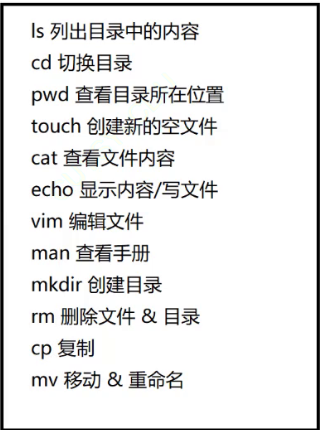

#### **ls**

列出当前目录中，都有哪些内容（包含的文件和目录）。ls后面也可以跟上一个指定的目录，ls /  

Linux上一定会有/这个目录，根目录。  更多的时候，使用是  ls -l 或者（ll）

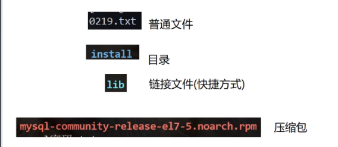


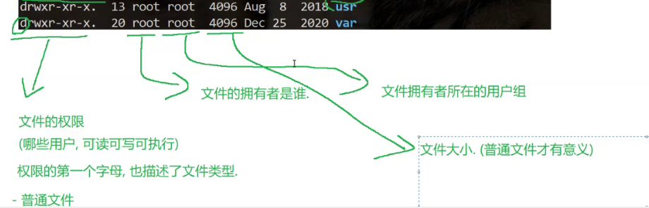


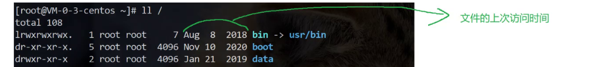

```
-a 列出目录下的所有文件，包括以 . 开头的隐含文件。 
-d 将目录象文件一样显示，而不是显示其下的文件。 如：ls –d 指定目录 
-k 以 k 字节的形式表示文件的大小。ls –alk 指定文件 
-l 列出文件的详细信息。 
-r 对目录反向排序。 
-t 以时间排序。 
-R 列出所有子目录下的文件。(递归)
```


#### **cd**

（change directory）  切换目录的位置

cd切换到的目录的名称（绝对路径：Linux以/开头；相对路径：以 .或者 ..开头的，.可以省略）

```
cd .. : 返回上级目录
cd ~：进入用户家目
cd -：返回最近访问目录
```


#### **pwd**

查看当前位置的绝对路径


#### **touch**

新建一个不存在的文件。

touch test.txt


#### **cat**

查看目标文件的内容

cat test.txt


#### **echo**

写入内容

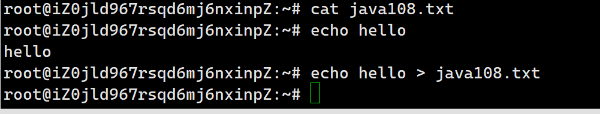


#### **vim**

完成针对文件进行更细的编辑（文本编辑器）

1.打开文件：vim 文件名

2.编辑文件：默认是普通模式，普通模式下键盘的按键表示一些特殊功能的快捷键. (例如按下 j 并不是输入字母 "j", 而是表示光标往下移动一行). 需要进入插入模式才能进行文本编辑。按 i 进入插入模式。退出时，按esc回到普通模式

3.保存退出：先输入“ ：”，接下来输入就是vim命令，wq 回车（w:保存，q：退出）

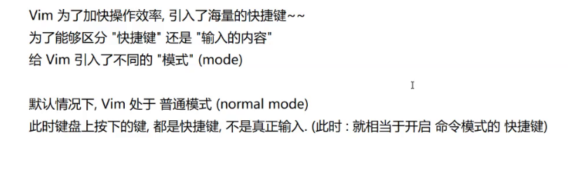

#### **mkdir**

make directory,创建目录

-p, --parents 可以是一个路径名称。此时若路径中的某些目录尚不存在,加上此选项后,系统将自动建立好那些尚不存在的目录,即一次可以建立多级目录（mkdir aaa/bbb/ccc -p)


#### **rm**

删除文件或者删除目录

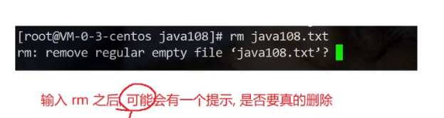

​                                                                  敲 y 删除，其他的为取消

```
-f 即使文件属性为只读(即写保护)，亦直接删除
-i 删除前逐一询问确认
-r 删除目录及其下所有文件，(rm -r aaa)
```


#### **cp**

复制文件或目录 

```
cp test1.txt test2.txt  —— 将test1重命名

cp test1.txt ddd/       —— 将test1复制到ddd

cp ddd/ fff  -r         —— 将ddd复制成fff   
-r递归处理，将指定目录下的文件与子目录一并处理。若源文件或目录的形态，不属于目录或符号链接，则一律视为普通文件处理 
```


#### **mv**

- mv test1.txt eee/test2.txt  ——  mv命令将文件重命名或将其移至一个新的目录中。 
-  当第二个参数类型是文件时，mv命令完成文件重命名
- 当第二个参数是已存在的目录名称时，源文件或目录参数可以有多个，mv命令将各参数指定的源文件均移至目标目录中。 


#### **grep**

字符串搜索/匹配命令

用于查找文件中是否包含指定字符串, 并显示对应的行.

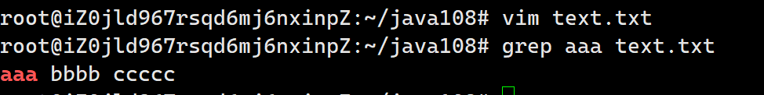


#### **ps**

显示进程列表

ps aux  显示系统上所有的进程

ps aux | grep 进程名

ps aux | grep 进程id


#### **netstat**

查看系统上的网络状态

netstat -anp

netstat -anp | grep 进程名

netstat -anp | grep 端口号


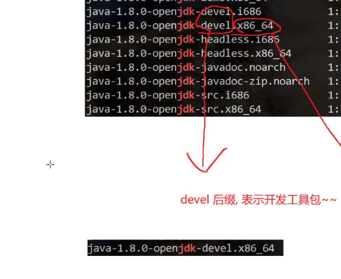

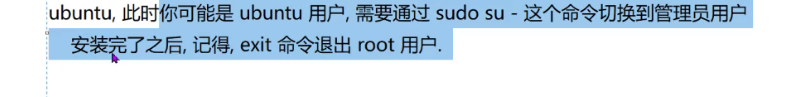

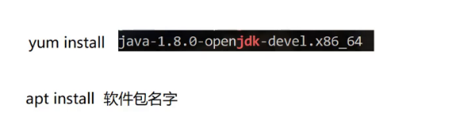

