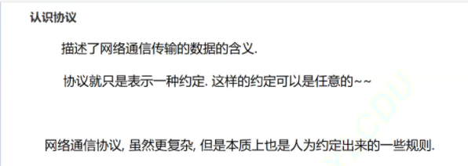
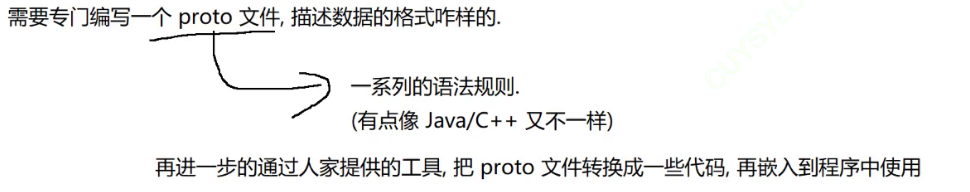
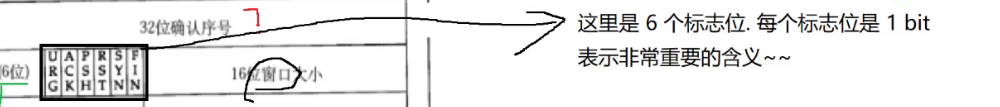
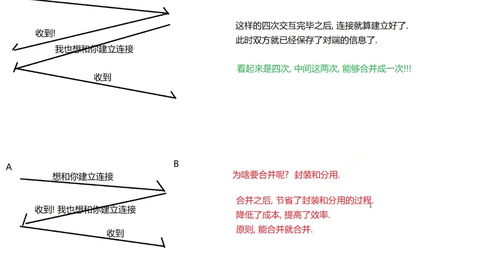
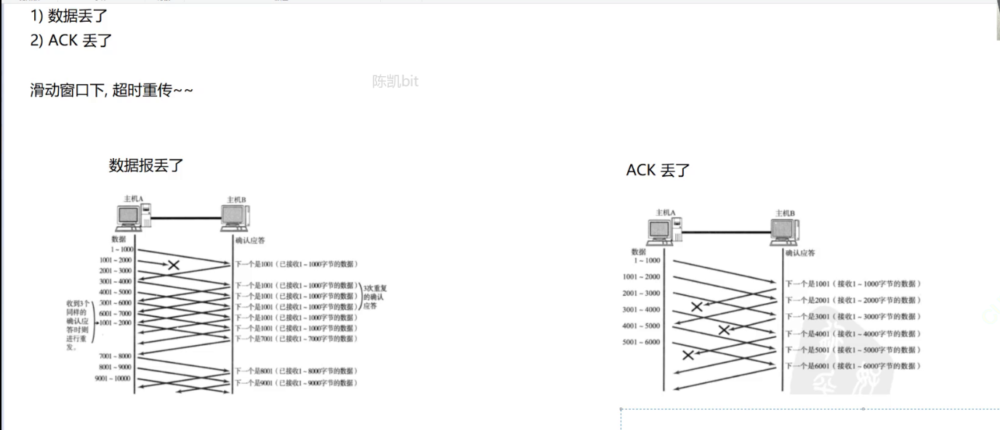
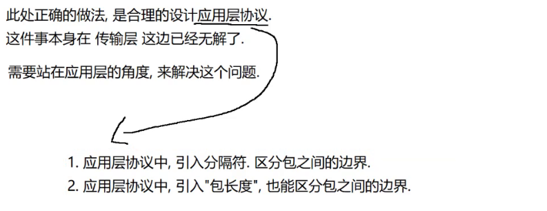
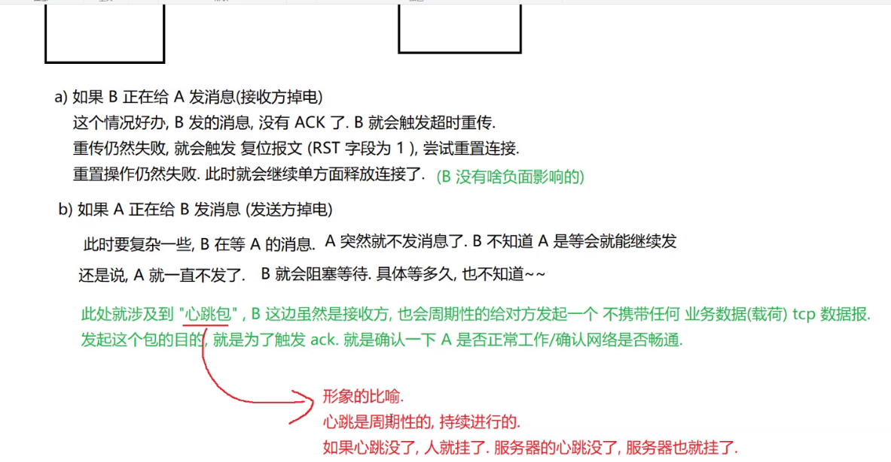
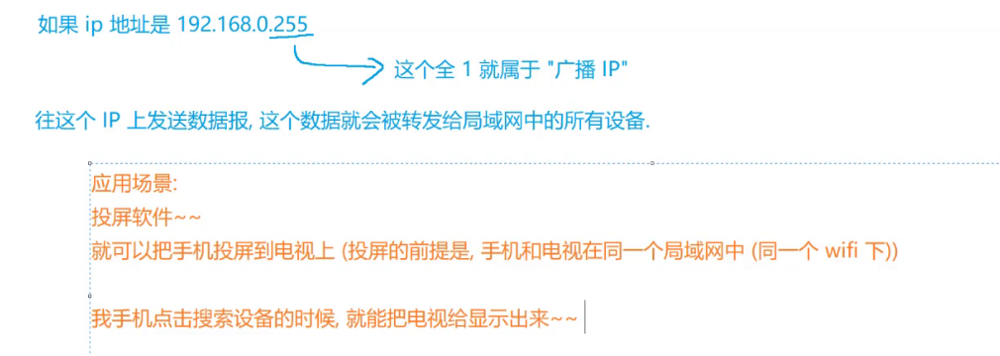
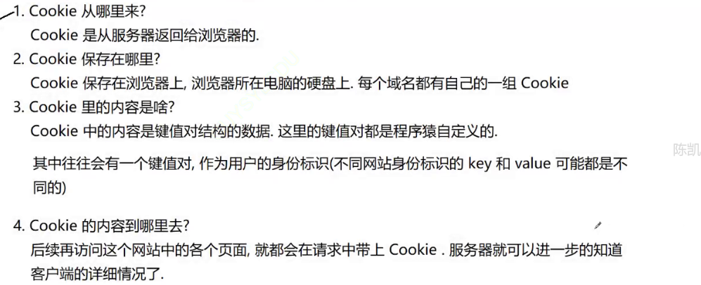
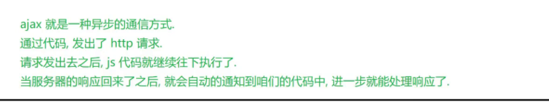

# 网络原理

## 1.网络原理初识

随着时代的发展，越来越需要计算机之间互相通信，共享软件和数据，即以多个计算机协同工作来完成

业务，就有了网络互连。

网络互连：将多台计算机连接在一起，完成数据共享。

数据共享本质是**网络数据传输**，即计算机之间通过网络来传输数据，也称为**网络通信**。

根据网络互连的规模不同，可以划分为局域网和广域网。


**局域网LAN**

局域网，即 Local Area Network，简称LAN。

Local 即标识了局域网是本地，局部组建的一种私有网络。局域网内的主机之间能方便的进行网络通信，又称为内网；局域网和局域网之间在没有连接的情况下，是无法通信的。


**广域网WAN**

广域网，即 Wide Area Network，简称WAN。

通过路由器，将多个局域网连接起来，在物理上组成很大范围的网络，就形成了广域网。广域网内部的局域网都属于其子网。


路由器上，有lan口和wan口


虽然只有4个lan口，实际上组建的局域网可以有更多设备，通过交换机

交换机的口不分lan，wan


AP相当于一个不用插网线的小交换机（提供无限热点扩容能力）


------

**网络通信基础**

网络互连的目的是进行网络通信，也即是网络数据传输，更具体一点，是网络主机中的不同进程间，基

于网络传输数据。

那么，在组建的网络中，如何判断到底是从哪台主机，将数据传输到那台主机呢？这就需要使用IP地址

来标识。




电脑种类很多，设备厂商也有很多，必须有一份统一的协议标准来研发设备，大家搞出来的都可以在一起互相通信了


**TCP/IP五层（或四层）模型**

TCP/IP是一组协议的代名词，它还包括许多协议 ，组成了TCP/IP协议簇。

TCP/IP通讯协议采用了5层的层级结构，每一层都呼叫它的下一层所提供的网络来完成自己的需求。

**应用层**：负责应用程序间沟通，如简单电子邮件传输（SMTP）、文件传输协议（FTP）、网络远程

访问协议（Telnet）等。我们的网络编程主要就是针对应用层。

**传输层**：负责两台主机之间的数据传输。如传输控制协议 (TCP)，能够确保数据可靠的从源主机发

送到目标主机。

**网络层**：负责地址管理和路由选择。例如在IP协议中，通过IP地址来标识一台主机，并通过路由表

的方式规划出两台主机之间的数据传输的线路（路由）。路由器（Router）工作在网路层。

**数据链路层**：负责设备之间的数据帧的传送和识别。例如网卡设备的驱动、帧同步(就是说从网线上

检测到什么信号算作新帧的开始)、冲突检测(如果检测到冲突就自动重发)、数据差错校验等工作。

有以太网、令牌环网，无线LAN等标准。交换机（Switch）工作在数据链路层。

**物理层**：负责光/电信号的传递方式。比如现在以太网通用的网线(双绞 线)、早期以太网采用的的同

轴电缆(现在主要用于有线电视)、光纤，现在的wifi无线网使用电磁波等都属于物理层的概念。物理

层的能力决定了最大传输速率、传输距离、抗干扰性等。集线器（Hub）工作在物理层。


**五元组**

在TCP/IP协议中，用五元组来标识一个网络通信：

1. 源IP：标识源主机

2. 源端口号：标识源主机中该次通信发送数据的进程

3. 目的IP：标识目的主机

4. 目的端口号：标识目的主机中该次通信接收数据的进程

5. 协议号：标识发送进程和接收进程双方约定的数据格式

   ------
   
   

**A把消息通过QQ发给主机B**

发生方情况：


1.应用层

qq应用程序，从输入框中获取你要输入的消息。构造成应用层数据报（根据应用层协议）

构造...过程就是按照一定格式进行字符串拼接       发送方和接收方需达成一致


应用程序就会调用传输层提供的接口，把上述数据交给传输层进行处理~~


2.传输层


UDP不关心应用层数据，里面都有什么

只是把应用层数据当作一个字符串，构造出一个UDP数据报


3.网络层

网络最主要协议是IP协议

IP协议也会根据自己格式，构造出IP数据报


4.数据链路层

以太网，针对IP数据报，进行下一步分装，再添上数据头和数据尾


5.物理层

硬件设备（网卡）

本质上都是二进制的数据

硬件设备就需要对上述数据进行转换了~~光信号/电信号/电磁波


**到这里完成了发送过程**


接受方的情况（主机B）：


1.物理层（硬件设备，网卡），收到光信号/电信号/电磁波

需要把收到的信号进行解调得到一串0101二进制数据序列，也就是以太网数据帧


这个数据就要被交给上一层，数据链路层

*调制：把你要传输的信息放到光电信号中*

*解调：把光电信号中把信息取出来*


2.数据链路层

数据链路层的以太网协议，就会针对这个数据进行解析


此时把载荷部分取出来，交给上层（IP协议）


3.网络层

IP协议针对这个数据报进行解析，去掉IP报头，取出载荷，进一步交给传输层


4.传输层

根据IP报头中的字段，就知道当前这个载荷是一个UDP数据报，交给UDP处理

UDP也是要针对数据报进行解析，去掉报头，去出载荷，进一步的交给应用程序


5.应用层

UDP报头中，有一个字段，目的端口。根据目的端口找到关联的应用程序，就交给这个程序即可

qq收到了这个数据，就会按照QQ的应用层协议，进行解析


------

主机A，从上到下，依次添加报头的过程，称为封装（打包快递）

主机B，从下到上，依次解析报头的过程，称为分用（拆快递）


------


## 2.进行具体的网络编程

写一个应用程序，让这个程序可以使用网络通信（需要调用传输层提供的api）


UDP:无连接，不可靠传输，面向数据报，全双工

TCP:有连接，可靠传输，面向字节流，全双工


*无连接相当于 发微信/短信，不需要建立连接，就能进行通信~~*


*可靠传输的传输效率降低了，不可靠传输效率更高*


全双工：一个通道，可以双向通信

半双工：一个通道，只能单向通信

------

**UDP的socket api**（按字节来处理）

两个核心的类：

**1**.DatagramSocket

​       是一个Socket对象（要进行网络通信，必须得先有socket对象）


DatagramSocket()  在客户端这边使用（客户端使用哪个端口，系统自动分配）         

DatagramSocket(int port)  在服务器这边使用（手动指定）


**2**.DatagramPacket

表示了一个UDP数据报，代表了系统中设定得UDP数据报的二进制结构


手写UDP客户端服务器


一个服务器要给很多客户端提供服务

服务器也不知道客户端啥时候来

服务器只能时刻准备着，随时提供服务


```
//服务器代码

import java.io.IOException;
import java.net.DatagramPacket;
import java.net.DatagramSocket;
import java.net.SocketException;

//UDP的回显服务器
//客户端发的请求是啥，服务器返回的响应就是啥
public class UdpEchoServer {
    private DatagramSocket socket = null;

    //参数是服务器要绑定的端口
    public UdpEchoServer(int port) throws SocketException {
        socket = new DatagramSocket(port);
    }

    //使用这个方法启动服务器
    public void start() throws IOException {
        System.out.println("服务器启动！");
        while(true){
            //反复的长期的针对客户端请求处理的逻辑
            //1.读取请求，并解析
            DatagramPacket requestPacket = new DatagramPacket(new byte[4096],4096);
            socket.receive(requestPacket);
            //这样的转字符串的前提是，后续客户端发的数据就是一个文本的字符串
            String request = new String(requestPacket.getData(),0, requestPacket.getLength());

            //2.根据请求，计算出响应
            String response = process(request);

            //3.把响应写回给客户端
            //此时需告知网卡，要发的内容是啥，要发给谁
            DatagramPacket responsePacket = new DatagramPacket(response.getBytes(),response.getBytes().length,
                    requestPacket.getSocketAddress());
            socket.send(responsePacket);
            //记录日志，方便观察程序执行效果
            System.out.printf("[%s:%d] req: %s, resp: %s\n", requestPacket.getAddress().toString(),requestPacket.getPort(),
                    request,response);
        }
    }

    public String process(String request){
        return request;
    }

    //根据请求计算响应，由于是回显程序，响应内容和请求完全一样
    public static void main(String[] args) throws IOException{
        UdpEchoServer server = new UdpEchoServer(9090);
        server.start();
    }
}
```

```
//客户端代码

import java.io.IOException;
import java.net.*;
import java.util.Scanner;

public class UdpEchoClient {
    private DatagramSocket socket = null;
    private String serverIp;
    private int serverPort;

    //参数是服务器的ip 和 服务器的端口
    public UdpEchoClient(String ip,int port) throws SocketException {
        serverIp = ip;
        serverPort = port;
        //这个new操作，就不再指定端口了，让系统自动分配一个空闲端口
        socket = new DatagramSocket();
    }

    //让这个客户端反复的从控制台读取用户输入的内容，把这个内容构造成UDP请求，发给服务器，再读取服务器返回的UDP响应，最终显示在客户端的屏幕上
    public void start() throws IOException {
        Scanner scanner = new Scanner(System.in);
        System.out.println("客户端启动！");
        while (true) {
            //1.从控制台读取用户输入内容
            System.out.print("-> ");
            String request = scanner.next();

            //2.构造请求对象，并发给服务器
            DatagramPacket requestPacket = new DatagramPacket(request.getBytes(),request.getBytes().length,
                    InetAddress.getByName(serverIp),serverPort);
            socket.send(requestPacket);

            //3.读取服务器的响应，并解析出响应内容
            DatagramPacket responsePacket = new DatagramPacket(new byte[4096],4096);
            socket.receive(responsePacket);
            String response = new String(responsePacket.getData(),0,responsePacket.getLength());

            //4.显示到屏幕上
            System.out.println(response);
        }
    }

    public static void main(String[] args) throws IOException {
        UdpEchoClient client = new UdpEchoClient("127.0.0.1",9090);
        client.start();
    }
}
```


更多的时候，期望，服务器有业务，解决实际问题

如翻译服务器（cat => 猫）

```
import java.io.IOException;
import java.net.SocketException;
import java.util.HashMap;
import java.util.Map;

public class UdpDictServer extends UdpEchoServer{
    private Map<String,String> dict = new HashMap<>();
    public UdpDictServer(int port) throws SocketException {
        super(port);

        dict.put("cat","小猫");
        dict.put("dog","小狗");
        dict.put("fuck","卧槽");
        //可以在这里添加千千万万个单词，使每个单词都有一个对应的翻译
    }

    //是要复用之前的代码，但是又要做出调整
    @Override
    public String process(String request){
        //把对应请求的单词的翻译，给返回回去
        return dict.getOrDefault(request,"该词没有查询到");
    }

    public static void main(String[] args) throws IOException {
        UdpDictServer server = new UdpDictServer(9090);
        //start不需要重新再写一遍了，直接就复用了之前的start
        server.start();
    }
}
```

------

**TCP**提供的api也是主要有两个类。

ServerSocket

Socket

字节流，一个字节一个字节进行传输的

一个tcp数据报，就是一个字节数组 byte[]


*TCP版本的回显服务器*

进入循环后，要做的事情不是读取客户端的请求，而是先处理客户端的“连接”


*客户端代码*

1.从控制台读取用户输入

2.把输入的内容构造成请求并发送给服务器

3.从服务器读取响应

4.把响应显示在控制台上


```
import java.io.IOException;
import java.io.InputStream;
import java.io.OutputStream;
import java.io.PrintWriter;
import java.net.ServerSocket;
import java.net.Socket;
import java.util.Scanner;
import java.util.concurrent.ExecutorService;
import java.util.concurrent.Executors;

public class TcpEchoServer {
    private ServerSocket serverSocket = null;

    //此处不应该创建固定线程数目的线程池
    private ExecutorService service = Executors.newCachedThreadPool();

    //这个操作就会绑定端口号
    public TcpEchoServer(int port) throws IOException{
        serverSocket = new ServerSocket(port);
    }

    //启动服务器
    public void start() throws IOException {
        System.out.println("服务器启动！");
        while (true){
            Socket clientSocket = serverSocket.accept();
            //单个线程，不太方便完成这里的一边拉客，一边介绍，需要多线程。主线程专门负责拉客，每次有一个客户端，都创建一个新的线程去负责处理客户端的各种请求
    //     Thread t = new Thread(() -> {
    //           processConnection(clientSocket);
    //       });
    //       t.start();
            //使用线程池解决上述问题
            service.submit(new Runnable(){
                @Override
                public void run(){
                    processConnection(clientSocket);
                }
            });
        }

    }

    //通过这个方法来处理一个连接的逻辑
    private void processConnection(Socket clientSocket){
        System.out.printf("[%s:%d] 客户端上线!\n",clientSocket.getInetAddress().toString(),clientSocket.getPort());
        //接下来读取请求，根据请求计算响应，返回响应三步走了
        //Socket 对象内部包含了两个字节流对象，可以把这两字节流对象获取到，完成后续的读写工作
        try(InputStream inputStream = clientSocket.getInputStream();
            OutputStream outputStream = clientSocket.getOutputStream()){
            //一次连接中，可能会涉及到多次请求/响应
            while (true){
                //1.读取请求并解析，为了读取方便，直接使用Scanner
                Scanner scanner = new Scanner(inputStream);
                if(!scanner.hasNext()){
                    //读取完毕，客户端下线
                    System.out.printf("[%s:%d] 客户端下线!\n",clientSocket.getInetAddress().toString(),clientSocket.getPort());
                    break;
                }
                //这个代码暗含一个约定，客户端发来的请求，得是文本数据，同时，还得有空白符作为分割
                String request = scanner.next();

                //2.根据请求计算响应
                String response = process(request);

                //3.把响应写回给客户端，把OutputStream 使用 PrinterWriter 包裹一下，方便进行发数据
                PrintWriter writer = new PrintWriter(outputStream);
                //  使用 PrintWriter 的 println 方法，把响应返回给客户端
                //  此处使用println，而不是 print 就是为了在结尾加上 \n ，方便客户端读取响应，使用 scanner.next 读取
                writer.println(response);
                //  这里还需要加一个“刷新缓冲区” 操作
                writer.flush();

                //日志，打印当前的请求详情
                System.out.printf("[%s:%d] req: %s, resp: %s\n",clientSocket.getInetAddress().toString(),clientSocket.getPort(),
                        request,response);
            }
        }catch (IOException e){
            e.printStackTrace();
        }finally {
            //在finally中加上close操作，确保当前socket被及时关闭
            try {
                clientSocket.close();
            }catch (IOException e){
                e.printStackTrace();
            }
        }
    }

    public String process(String request){
        return request;
    }

    public static void main(String[] args) throws IOException {
        TcpEchoServer server = new TcpEchoServer(9090);
        server.start();

    }
}
```

```
import java.io.IOException;
import java.io.InputStream;
import java.io.OutputStream;
import java.io.PrintWriter;
import java.net.Socket;
import java.util.Scanner;

public class TcpEchoClient {
    private Socket socket = null;

    public TcpEchoClient(String serverIp, int serverPort) throws IOException {
        socket = new Socket(serverIp,serverPort);
    }

    public void start(){
        System.out.println("客户端启动");

        Scanner scannerConsole = new Scanner(System.in);

        try(InputStream inputStream = socket.getInputStream();
            OutputStream outputStream = socket.getOutputStream()){
            while(true){
                //1.从控制台输入字符串
                System.out.print("-> ");
                String request = scannerConsole.next();

                //2.把请求发给服务器
                PrintWriter printWriter = new PrintWriter(outputStream);
                //   使用println带上换行，后续服务器读取请求，就可以使用 scanner.next来获取了
                printWriter.println(request);
                // 不要忘记flush，确保数据是真的发送出去了
                printWriter.flush();

                //3.从服务器读取响应
                Scanner scannerNetwork = new Scanner(inputStream);
                String response = scannerNetwork.next();

                //4.把响应打印出来
                System.out.println(response);
            }
        } catch(IOException e){
            e.printStackTrace();
        }

    }

    public static void main(String[] args) throws IOException {
        TcpEchoClient client = new TcpEchoClient("127.0.0.1",9090);
        client.start();
    }
}
```


------

## 3.数据组织格式


实际上，上述这样的格式约定，咋样都行。任意进行约定的，只要保证，客户端和服务器遵守同一个约定即可


**1.xml**

是以成对的标签，来表示“键值对"信息，同时标签支持嵌套，就可以构成一些更复杂的树形结构数据


响应：

```
<response>

​    <shops>

​           <name>魏家凉皮</name>

​           <image>1.jpg</image>

​           <distance>1km</distance>

​           <rate>96%</rate>

​           <star>4.7</star>

​     </shop>

​     <shops>

​           <name>肯德基</name>

​           <image>2.jpg</image>

​           <distance>1km</distance>

​           <rate>96%</rate>

​           <star>4.7</star>

​     </shop>

</response>
```


优点:xml非常清晰的把结构化数据表示出来了

缺点：表示数据需要引入大量的标签，看起来很繁琐，同时也会占用不少的网络带宽


**2. json**（最流行的一种数据组织格式）

本质也是键值对，看起来，比xml要干净不少   。可读性非常好。方便观察中间结果，好调试问题

终究是需要花费一定的带宽来传输key的名字的

使用 { } 表示 键值对，使用 [ ] 表示 数组。数组的每个元素，可以是数字，可以是字符串，还可以是其他的{ } 或 [ ]

未来在实际开发中会经常用到json格式的数据

```
//请求
{
  userld:1234
  position:"100 80"
}


//响应
[
  {
    name:'魏家凉皮',
    image:'1.jpg',
    distance:'1km',
    rate:96%,
    star:4.7
  },
  {
    name:'肯德基',
    image:'2.jpg',
    distance:'1km',
    rate:96%,
    star:4.7
  }
]
```

json对于换行并不敏感，如果这些内容全放在同一行，也是完全合法的

一般网络传输的时候，会对json进行压缩（去掉不必要的空格和换行），同时把所有数据放到一行去。整体占用的带宽就更降低了（影响可读性）

有很多现成的json格式化工具


**3.protobuffer**（主要用于，对于性能要求更高的场景，牺牲了开发效率，换来运行效率）

谷歌提出的一套，二进制的数据序列化方式

使用二进制的方式，约定某几个字节，表示哪个属性...  

最大程度的节省空间（不必传输key，根据位置和长度，区分每个属性的）

二进制数据，无法肉眼直接观察，不方便调试。使用起来比较复杂



------

## 4.传输层

UDP  TCP

### UDP

基本特点  无连接  不可靠传输  面向数据报  全双工


合法的端口号，有效范围 0~65535   实际上0不会使用的

1~1024这个范围的端口号（知名端口号），系统赋予了特定的含义，一般也不建议使用


UDP校验使用了一种简单粗暴的CRC校验算法

把UDP数据报中的每个字节，都依次进行累加~     把累加结果，保存到2个字节的变量中，加着，可能就溢出了——溢出也无所谓。所有字节都加了一遍，最终就得到了校验和

传输数据的时候，就会把原始数据和校验和一起传递过去

接受方收到数据，同时也收到了发送端送过来的校验和（旧的校验和）

接收方按照同样的方式再算一遍~~得到新的校验和，如果旧的校验和 和 新的校验和，相同，就可以视为数据传输过程中是正确的。如果不同，则视为传输过程中数据出错了


### TCP

#### 设定

要想知道完整的TCP具体有哪些设定 -->RFC标准文档


端口号是一个重要的部分，知道了端口号，才能进一步的确认这个数据报交给哪个应用程序       端口号属于传输层

TCP的报头是“变长“的  （4 bit 表示范围：0-> 15）单位是字节，把数值*4才是真正的报头长度

TCP报头，最大长度，60字节~    TCP报头的前20个字节是固定的（最短长度20字节）

选项部分，可以有，也可以没有。可以有一个选项，也可以有多个选项

需要使用首部长度，来确认，报头到哪里就结束了，载荷数据是从哪里开始




TCP特点：有连接，

　　　　　可靠传输（内核实现的　可靠传输，写代码的时候是感知不到的～让人感知成本低，使用成本也低了）

　　　　　面向字节流，

　　　　　全双工


#### **确认应答机制**


由于TCP是面向字节流的，不是按照“条”为单位传输

1.针对字节进行编号的，而不是针对“条”   2.应答报文也是要和收到的数据的序号相关联，但是不是“相等”


确认序号的数值就是收到的最后一个字节的编号再加一

需要有办法能区分出，当前这个报文是普通报文，还是一个确认应答报文

- ACK为0 表示这是一个普通的报文。此时只有32位序号是有效的
- ACK为1 表示这是一个应答报文，这个报文的 序号 和 确认序号 都是有效的  

（确认报文序号和正常报文的序号，之间没有关联关系。序号，是自己这个主机发送的数据进行的编号）

ACK —— acknowledge 应答        也会使用ack这个词，来代指应答报文


确认应答，是TCP保证可靠性的最核心机制


#### **超时重传机制**


发送方无法区分是哪种情况，那么就重传

应答报文丢包，这个场景下，B同一条信息（1~1000）收到了两次

接收方收到数据之后，需要对数据进行去重。保证应用程序调用inputStream.read的时候，读到的不会出现重复

**直接使用tcp的序号来作为判定依据**

tcp会在内核中，给每个socket对象都安排一个内存空间，相当于一个队列，也称为“接收缓冲区”。收到的数据都会被放到接收缓冲区里，并且按照序号排列好顺序。   此时就可以很容易的找到该新收的数据是否重复了

等待超时时间，会随着重传轮次增加，等待时间也会越来越长。重传次数达到一定程度，也就放弃了，此时会尝试“重置”tcp连接（TCP复位报文）


#### **连接管理机制**

- 1.建立连接（三次握手）

发一个打招呼的数据，来触发特定场景（这个数据并不会携带业务信息）

A和B完成建立连接的过程，就需要“三次”这样的打招呼的数据交互




ACK是应答报文

SYN是申请建立连接的请求


三次握手，第一次syn一定是客户端发起的（客户端是主动的一方）


服务器这边针对三次握手配合，是不需要涉及任何的应用层代码。只要这个进程是绑定了对应tcp端口，就可以在内核中自动的配合完成三次握手

`Socket clientSocket = serverSocket.accept( );`

三次握手完成之后，客户端和服务器都形成了“连接”，此时accept就能够返回，从连接队列中取出队首元素，进一步的获取到其中的socket对象，来和对端通信


*（注：单线程TCP服务器。服务器在处理第一个客户端的时候，虽然无法调用第二次accept，但是不影响内核的工作，内核已经和第二个客户端三次握手完成了。形成的连接对象是在 连接队列里（socket）。连接已经形成了，但是在队列中暂时没人取，accept工作就是把队列中的元素取出来）*

- 2.断开连接（四次挥手）

连接，通信双方，各自在内存中保存对端的相关信息的。如果不需要连接了，就得及时的释放上述存储空间。

 

四次挥手有时候可以三次完成，但有时候不行。   

FIN的触发，是应用程序代码 来控制的。调用socket。close( )，或者进程结束，就会触发FIN

相比之下，ACK是内核控制的，收到FIN就会立即返回

**如果服务器，始终不进行close，会咋样？客户端的连接就始终不关闭吗？**


**如果通信过程中，出现丢包了，又咋处理？**

三次握手，四次挥手，也都是带有重传机制。尽可能重传，如果重传失败，连续多次，此时仍然会单方面释放连接

如果最后一个ACK丢失，B就会重新传过来一个FIN。此时如果A已经把连接释放了，重传的FIN就无人能够进行ACK了。    因此。就需要让A在发出去最后一个ACK之后，让连接再等一会（主要就是看等的过程中会不会收到对方重传的FIN）           如果等了一定时间之后，对方还没有重传FIN，此时A才能正确释放连接

 <u>*A这边等待多久才能释放连接？*</u>

等待时间就是  网络上任意两点之间传输数据的最大时间*2（定义为  MSL）


#### **滑动窗口**

提高传输效率（让TCP在可靠传输的前提下，效率不要太拉胯）


滑动窗口，实际上就是 批量发送数据

这样就可以缩短等待时间，比之前能提升一定的效率

**如果出现丢包了**

  

​         

| 数据报丢了，此时必须要进行重传                               | ACK如果丢了，不用做任何处理，也是正确的                      |
| :----------------------------------------------------------- | :----------------------------------------------------------- |
| 在1000~2000丢失后，2001~3000这个数据到达了B，B返回的ACK确认序号，仍然是1001。B仍然向A索要1001这个数据~     *当A连续几次都收到了来自于B的索要 1001 的数据，A就明白了，1001是丢了。A就会重新传输1001~2000这个数据* | 2001确认序号，表示2001之前的数据都收到了，也包含1-1001.虽然A没有收到1001这个ACK，但是2001这个ACK涵盖了1001的含义 |


如果通信双方大规模传输数据，肯定是滑动窗口                             （此时仍然按照快速重传来工作）

如果通信双方传输数据规模比较少，这个时候就不会滑动窗口了  （仍然按照之前的超时重传来工作）


#### 流量控制

滑动窗口，窗口越大，传输效率越高

但是窗口也不能无限大。如果窗口太大，就可能使接收方处理不过来了。或者使传输的中间链路出现处理不过来，这样就会出现丢包，就得重传

**<u>流量控制</u>**，就是给滑动窗口 踩刹车。避免让窗口太大，导致接收方处理不过来~~

*根据接收方的处理能力，来限制发送方的发送速度（窗口大小）*

**如何衡量接收方的处理速度？**    

此处就使用 <u>接收缓冲区剩余空间大小</u>（如果剩余空间越大，应用程序消费数据的程度就越快） 来衡量指标

就会直接把接收缓冲区的剩余空间大小，通过ack报文反馈给发送方，作为发送方下一次发送数据，窗口大小参考依据~~


#### 拥塞控制

总的运输效率，是一个木桶效应，取决于最短板


把中间设备都看成一个整体，采用”实验“的方式，动态调整，产生出一个合适的窗口大小

(1) 使用一个较小的窗口传输。如果传输通常，就调大窗口

(2) 使用一个较大的窗口传输，如果传输丢包（出现拥堵），就调小窗口


TCP中，拥塞控制具体是这样展开的:

1. **慢启动**：刚开始进行通信的时候，会使用一个非常小的窗口，先试试水
2. **指数增长**：在传输过程中，拥塞窗口就会指数增长（*2）                                                                                                      *指数增长速度是极快的，不能不加限制，否则就会出现非常大的值*
3. **线性增长**：指数增长当拥塞窗口达到一个阈值之后，就会从指数增长，转换成 线性增长（+n）                   这里的指数增长和线性增长，都是按照传输的轮次。线性增长，也是增长，就会使发送速度越来越快。快到一定程度，接近网络传输的极限，就可能会出现丢包
4. **拥塞窗口回归小窗口**：当窗口大小增长过程中，如果传输出现丢包，认为当前网络出现拥堵了。此时就会把窗口大小调整成最初的小窗口继续回到之前 指数增长 + 线性增长 的过程。另外此处也会根据当前出现丢包的窗口大小，调整阈值（指数增长 —> 线性增长）


实际发送方的窗口 = min(拥塞窗口，流量控制窗口)

此处不光要考虑接收方的处理能力，更要考虑中间节点的处理能力

拥塞控制和流量控制，共同限制了滑动窗口机制，可以使滑动窗口，能够在可靠性的前提下，提高传输效率


#### **延迟应答**   

提高传输效率的机制。围绕滑动窗口想出来的

**是否有办法在条件允许的基础上，尽可能的提高窗口大小呢？**

需要在返回ack的时候，拖延一点时间，利用拖延的这个时间，就可以给应用程序腾出来更多的消费数据的时间。接收缓冲区的剩余空间，就会更大了 


此处，到底通过延时应答，能提高多少速度，还是取决于接收方应用程序的实际处理能力


#### 捎带应答

在延时应答的基础上，引入第一个进一步提高效率的方式

延时应答：是让ack传输的时机更慢      捎带应答：基于延时应答，让数据合并


**面向字节流**

在面向字节流的情况下，会产生一些问题

粘包响应：

通过tcp read/write 的数据，都是tcp报文的载荷，也就是应用层数据

发送方一次性是可以发送多个应用层数据报的，但是接收的时候，如何区分，从哪里到哪里是一个完整的应用数据报？  如果没设计好，接收方就很难区分，甚至会产生bug



1）使用\n约定包之间的分隔符（echo server就是这么设定的）

2）使用包的长度来进行区分


粘包问题，不仅仅是tcp才有。只要是面向字节流的机制，也有同样的问题。解决方案也是一样的


#### TCP异常情况的处理

- 1）进程崩溃

  进程没了  =>  PCB没了  => 文件描述符表也就被释放了  =>  相当于调用 socket.close( )  =>  崩溃的一方就会发出FIN，进一步触发 四次挥手。此时连接就正常释放了

  

- 2）主机关机（正常关机）

  会先尝试干掉所有的进程，和上面崩溃的处理是一样的。主机关机会有一定时间，在这个时间之内，四次挥手可能是挥完，没挥完也不要紧

  

- 3）主机掉电（拔电源，没有反应空间）

  

  

- 4）网线断开

此时A和B 无法通信

A这边，是主机掉电的第一种情况

B这边就是主机掉电第二种情况


还有很多特性，在 标准文档 上


#### TCP 和 UDP对比

TCP 优势在于可靠性  适用于绝大部分场景

UDP 优势在于效率   适合于机房内部的主机之间通信（机房内部，带宽比较充裕，不太容易遇到拥堵丢包的情况，又希望主机之间的通信速度能比较快）


------

## 5.网络层

### IP协议

        

1. 4位版本号，用来表示IP协议的版本。现有IP协议  IPv4  IPv6

2. 4位首部长度，设定和tcp一样   IP报头可变长，又是带有选项，此处单位也是4字节

3. 8位服务类型（真正只有四位才有效果）

   


4. 16位总长度

   IP报头 + 载荷 的长度

   总长度 - IP报头长度 => 载荷长度 => TCP报文总长度

   TCP报文总长度 - TCP报头长度 => TCP载荷长度

5. 


6. 


7. 8位协议

   描述了上层，传输层，使用哪种协议

   

8. 

9. 

   

   

   

10. 8位生存时间

    

 

IPv6  从根本上解决IP地址不够用得问题

IPv4，是4个字节，32位 表示IP地址，大约43亿左右

IPv6，是16个字节，128位，表示IP地址

IPv6和IPv4不兼容，升级IPv6不会提高网速


IP地址分两个部分

 1.网络号：**标识网段**，保证相互连接得两个网段具有不同得标识

 2.主机号：**标识主机**，同一网段内，主机之间具有相同得网络号，但是必须有不同的主机号

同一个局域网中的 网络号 必须相同，主机号 必须 不同

两个相邻的局域网，网络号必须不同


一个IP地址，哪个部分是网络号，哪个部分是主机号？

通过 子网掩码 来识别

子网掩码和IP地址一样是4字节，32位的整数


**特殊的IP地址**

- 将IP地址中的主机地址全部设为0，就成为了网络号，代表这个局域网；

- 将IP地址中的主机地址全部设为1，就成为了广播地址，用于给同一个链路中相互连接的所有主机发送数据包；

- 127.*的IP地址用于本机环回（loop back）测试，通常是127.0.0.1

- 本机环回主要用于本机到本机的网络通信（系统内部为了性能，不会走网络的方式传输），对于开发网络通信的程序（即网络编程）而言，常见的开发方式都是本机到本机的网络通信。

  


搜索过程，就可以基于广播IP来实现 


.com  公司

.cn  中国

.edu  教育组织

有一套系统，自动把域名翻译成IP地址


这么多主机上网，DNS服务器能承受这么高的并发量吗？

开源节流

1.每个电脑上，在进行域名解析的时候，都会有缓存。访问10次搜狗，只有第一次真正的访问DNS，后面9次都不一定访问

2.全世界会搭建出很多的“DNS镜像服务器 -----从最初的DNS服务器这里同步数据”（一般是网络运营商或者一些大厂）


**认识MAC地址**

MAC地址，即 Media Access Control Address，用于标识网络设备的硬件物理地址。

1. 主机具有一个或多个网卡，路由器具有两个或两个以上网卡；其中每个网卡都有唯一的一个MAC地址。

2. 网络通信，即网络数据传输，本质上是网络硬件设备，将数据发送到网卡上，或从网卡接收数据。

3. 硬件层面，只能基于MAC地址识别网络设备的网络物理地址。

   

   MAC地址用来识别数据链路层中相连的节点；

   长度为48位，及6个字节。一般用16进制数字加上冒号的形式来表示（例如：08:00:27:03:fb:19）

   在网卡出厂时就确定了，不能修改。虚拟机中的MAC地址不是真实的MAC地址，可能会冲突；也有些网卡支持用户配置MAC地址。


**总结IP地址和MAC地址**

IP地址描述的是**路途总体的起点和终点**；是给人使用的网络逻辑地址。

MAC地址描述的是路途上的每一个区间的起点和终点，即**每一跳的起点和终点**；是给网络硬件设备使用的网络物理地址。


源IP与目的IP标识整个路途的起点和终点；

源MAC与目的MAC标识了每一跳的起点和终点；

此时，需要根据发送端主机（源主机）与接收端主机（目的主机）是否在同一网段，来设置下一跳设备：源主机和目的主机在同一个网段时，下一跳设备就是目的主机；

发送端主机和接收端主机在不同网段时，发送端主机是无法知道目的主机在哪，此时会设置下一跳设备为网关设备；

所谓网关，我们这里可以简单理解为，不同网段的网络互连时，需要使用网关设备。

通常的网关设备是路由器，可以划分公网和局域网（内网），同时还可以把局域网划分为多个子网（不同网段）

Windows中，可以在网络设置中，更改适配器设置查看网关IP


------

## 6.数据链路层

### 认识以太网

"以太网" 不是一种具体的网络，而是一种技术标准；既包含了数据链路层的内容，也包含了一些物理层的内容。例如：规定了网络拓扑结构，访问控制方式，传输速率等；

例如以太网中的网线必须使用双绞线；传输速率有10M，100M，1000M等；

以太网是当前应用最广泛的局域网技术；和以太网并列的还有令牌环网，无线LAN等；

#### 以太网帧格式


### MTU

- MTU相当于发快递时对包裹尺寸的限制。这个限制是不同的数据链路对应的物理层，产生的限制以太网帧中的数据长度规定最小46字节，最大1500字节，ARP数据包的长度不够46字节，要在后面补填充位；
- 最大值1500称为以太网的最大传输单元（MTU），不同的网络类型有不同的MTU；
- 如果一个数据包从以太网路由到拨号链路上，数据包长度大于拨号链路的MTU了，则需要对数据包进行分片（fragmentation）；
- 不同的数据链路层标准的MTU是不同的；

#### MTU对IP协议的影响

- 由于数据链路层MTU的限制，对于较大的IP数据包要进行分包。
- 将较大的IP包分成多个小包，并给每个小包打上标签；
- 每个小包IP协议头的 16位标识（id） 都是相同的；
- 每个小包的IP协议头的3位标志字段中，第2位置为0，表示允许分片，第3位来表示结束标记（当前是否是最后一个小包，是的话置为1，否则置为0）；
- 到达对端时再将这些小包，会按顺序重组，拼装到一起返回给传输层；
- 一旦这些小包中任意一个小包丢失，接收端的重组就会失败。但是IP层不会负责重新传输数据；

#### MTU对UDP协议的影响

- 一旦UDP携带的数据超过1472（1500 - 20（IP首部） - 8（UDP首部）），那么就会在网络层分成多个IP数据报。
- 这多个IP数据报有任意一个丢失，都会引起接收端网络层重组失败。那么这就意味着，如果UDP数据报在网络层被分片，整个数据被丢失的概率就大大增加了。

#### MTU对于TCP协议的影响

- TCP的一个数据报也不能无限大，还是受制于MTU。TCP的单个数据报的最大消息长度，称为MSS（Max Segment Size）；
- TCP在建立连接的过程中，通信双方会进行MSS协商。
- 最理想的情况下，MSS的值正好是在IP不会被分片处理的最大长度（这个长度仍然是受制于数据链路层的MTU）。
- 双方在发送SYN的时候会在TCP头部写入自己能支持的MSS值。
- 然后双方得知对方的MSS值之后，选择较小的作为最终MSS。
- MSS的值就是在TCP首部的40字节变长选项中（kind=2）；

### **ARP协议**

虽然我们在这里介绍ARP协议，但是需要强调，ARP不是一个单纯的数据链路层的协议，而是一个介于数据链路层和网络层之间的协议；

#### ARP协议的作用

- ARP协议建立了主机 IP地址 和 MAC地址 的映射关系
- 在网络通讯时，源主机的应用程序知道目的主机的IP地址和端口号，却不知道目的主机的硬件地址；数据包首先是被网卡接收到再去处理上层协议的，如果接收到的数据包的硬件地址与本机不符，则直接丢弃；
- 因此在通讯前必须获得目的主机的硬件地址；

#### ARP协议的工作流程


- 源主机发出ARP请求，询问“IP地址是192.168.0.1的主机的硬件地址是多少”，并将这个请求广播到本地网段（以太网帧首部的硬件地址填FF:FF:FF:FF:FF:FF表示广播）；
- 目的主机接收到广播的ARP请求，发现其中的IP地址与本机相符，则发送一个ARP应答数据包给源主机，将自己的硬件地址填写在应答包中；
- 每台主机都维护一个ARP缓存表，可以用arp -a命令查看。缓存表中的表项有过期时间（一般为20分钟），如果20分钟内没有再次使用某个表项，则该表项失效，下次还要发ARP请求来获得目的主机的硬件地址

------

## 7.应用层

应用层，一方面是需要自定义协议，一方面也会用到一些现成协议

### HTTP协议

HTTP协议就是最常用到的应用层协议。尤其对于Java来说，HTTP比TCP更加重要

使用浏览器打开网站，过程都是由HTTP来支持的；使用手机app加载数据，这个过程大概率也是HTTP来支持的


HTTP  超文本 传输协议（除了传输字符串，还能传输其他的：图片，字体，视频，音频.......）


一个网站 = 前端 + 后端

前端：HTML（描述网页结构）、CSS（描述网页的样式）、JavaScript（描述网页行为）         后端：HTTP服务器

fiddler

**HTTP 是一个文本格式的协议. 可以通过 Chrome 开发者工具或者 Fiddler 抓包, 分析 HTTP 请求/响应的细节.** 


可以使用 ctrl + a 全选左侧的抓包结果, delete 键清除所有被选中的结果. 


HTTP是文本协议，TCP、IP、UDP是二进制协议


- 首行: [版本号] + [状态码] + [状态码解释]
- Header: 请求的属性, 冒号分割的键值对;每组属性之间使用\n分隔;遇到空行表示Header部分结束
- Body: 空行后面的内容都是Body. Body允许为空字符串. 如果Body存在, 则在Header中会有一个Content-Length属性来标识Body的长度; 如果服务器返回了一个html页面, 那么html页面内容就是在body中.

**HTTP请求** 


- Header: 请求的属性, 冒号分割的键值对;每组属性之间使用\n分隔;遇到空行表示Header部分结束
- Body: 空行后面的内容都是Body. Body允许为空字符串. 如果Body存在, 则在Header中会有一个Content-Length属性来标识Body的长度;

#### HTTP请求（Request)

##### **认识URL**

###### URL基本格式

平时我们俗称的 "网址" 其实就是说的 URL (Uniform Resource Locator 统一资源定位符). 

互联网上的每个文件都有一个唯一的URL，它包含的信息指出文件的位置以及浏览器应该怎么处理它. 

URL 的详细规则由 因特网标准RFC1738 进行了约定. (https://datatracker.ietf.org/doc/html/rfc1738)


**一个具体的 URL:**

```
https://v.bitedu.vip/personInf/student?userId=10000&classId=100
```

可以看到, 在这个 URL 中有些信息被省略了. 

**https :** 协议方案名. 常见的有 http 和 https, 也有其他的类型. (例如访问 mysql 时用的jdbc:mysql )

**user:pass :** 登陆信息. 现在的网站进行身份认证一般不再通过 URL 进行了. 一般都会省略

**v.bitedu.vip :** 服务器地址. 此处是一个 "域名", 域名会通过 DNS 系统解析成一个具体的 IP 地址. (通过 ping 命令可以看到, v.bitedu.vip 的真实 IP 地址为 118.24.113.28 )

**端口号:** 上面的 URL 中端口号被省略了. 当端口号省略的时候, 浏览器会根据协议类型自动决定使用哪个端口. 例如 http 协议默认使用 80 端口, https 协议默认使用 443 端口. 

**/personInf/student :** 带层次的文件路径. 

**userId=10000&classId=100 :** 查询字符串(query string). 本质是一个键值对结构. 键值对之间使用& 分隔. 键和值之间使用 = 分隔.  ？k1= v1&k2 = v2

**片段标识:** 此 URL 中省略了片段标识. 片段标识主要用于页面内跳转. (例如 Vue 官方文档: https://cn.vuejs.org/v2/guide/#%E8%B5%B7%E6%AD%A5, 通过不同的片段标识跳转到文档的不同章节)


**使用** **ping** **命令查看域名对应的** **IP地址**


**URL** **中的可省略部分**

- 协议名: 可以省略, 省略后默认为 http://
- ip 地址 / 域名: 在 HTML 中可以省略(比如 img, link, script, a 标签的 src 或者 href 属性). 省略后表示服务器的 ip / 域名与当前 HTML 所属的 ip / 域名一致. 
- 端口号: 可以省略. 省略后如果是 http 协议, 端口号自动设为 80; 如果是 https 协议, 端口号自动设为 443. 
- 带层次的文件路径: 可以省略. 省略后相当于 / . 有些服务器会在发现 / 路径的时候自动访问/index.html
- 查询字符串: 可以省略
- 片段标识: 可以省略


###### **关于URL encode**

像 / ? : 等这样的字符, 已经被url当做特殊意义理解了. 因此这些字符不能随意出现.

比如, 某个参数中需要带有这些特殊字符, 就必须先对特殊字符进行转义.

一个中文字符由 UTF-8 或者 GBK 这样的编码方式构成, 虽然在 URL 中没有特殊含义, 但是仍然需要进行转义. 否则浏览器可能把 UTF-8/GBK 编码中的某个字节当做 URL 中的特殊符号. 

转义的规则如下: 将需要转码的字符转为16进制，然后从右到左，取4位(不足4位直接处理)，每2位做一位，前面加上%，编码成%XY格式

"+" 被转义成了 "%2B"

urldecode就是urlencode的逆过程;

urlencode工具

[https://tool.chinaz.com/Tools/urlencode.aspx]: 


##### 认识"方法" (method)


 

GET通常把数据放到query string（用户可以看见）中，POST把数据放到body（用户不能看见）中

GET请求可以被缓存，POST不能被缓存

**谈谈 GET 和 POST 的区别**

语义不同: GET 一般用于获取数据, POST 一般用于提交数据. 

GET 的 body 一般为空, 需要传递的数据通过 query string 传递, POST 的 query string 一般为空, 需要传递的数据通过 body 传递

GET 请求一般是幂等的, POST 请求一般是不幂等的. (如果多次请求得到的结果一样, 就视为请求是幂等的). 

GET 可以被缓存, POST 不能被缓存. (这一点也是承接幂等性). 

**补充说明:**

- 关于语义: GET 完全可以用于提交数据, POST 也完全可以用于获取数据. 
- 关于幂等性: 标准建议 GET 实现为幂等的. 实际开发中 GET 也不必完全遵守这个规则(主流网站都有 "猜你喜欢" 功能, 会根据用户的历史行为实时更新现有的结果. 
- 关于安全性: 有些资料上说 "POST 比 GET 请安全". 这样的说法是不科学的. 是否安全取决于前端在传输密码等敏感信息时是否进行加密, 和 GET POST 无关. 
- 关于传输数据量: 有的资料上说 "GET 传输的数据量小, POST 传输数据量大". 这个也是不科学的, 标准没有规定 GET 的 URL 的长度, 也没有规定 POST 的 body 的长度. 传输数据量多少, 完全取决于不同浏览器和不同服务器之间的实现区别. 
- 关于传输数据类型: 有的资料上说 "GET 只能传输文本数据, POST 可以传输二进制数据". 这个也是不科学的. GET 的 query string 虽然无法直接传输二进制数据, 但是可以针对二进制数据进行 url encode. 

##### **认识请求 "报头" (header)**

header 的整体的格式也是 "键值对" 结构. 

每个键值对占一行. 键和值之间使用分号分割. 


**User-Agent (UA)**


**Referer**

描述了当前页面从哪里来

如果你是通过浏览器地址来直接输入url/点击收藏夹 点开的网页，这个请求是不带referer的

如果你是点击了某个网页的内容，产生了跳转，就是带referer 


**Cookie**

是浏览器本地存储数据的一种机制


与此同时，用户拿着网页操作过程中，也会产生出很多“临时性”数据。

有的临时数据可以放在服务器这边存储（下次就可以直接获取到了）；

有的不太重要的，就直接放在浏览器这边存储（下次就可以直接用到，但是换个电脑可能就没了）---->cookie就是一个主要的保存机制

**浏览器要保存数据，为什么放到Cookie中？直接放到硬盘，写入一个文件不行吗**

如果网页能够很轻易的访问你的文件系统，非常危险

为了保证安全，浏览器会对网页的功能做出限制（禁止直接访问硬盘，就是其中一个规则）




#### HTTP响应

1.首行 2.响应头 3.空行 4.正文

##### 首行

响应的首行，和请求相比，差异就比较大了


 实际开发中，经常需要能够手动的构造出HTTP协议请求

通过HTML中的from表单

现在更经常会使用ajax方式来构造http请求

```html
$.ajax({
    type: 'get',
    url: 'https://www.sogou.com',
    success: function(body){
        console.log('打印');
    }
});
/*  $在js里面，是一个合法地变量名
    $这个变量是在jQuery中已经定义好的，这个对象里就有很多方法，通过"$."的形式来调用对应的方法
    $.ajax()就是jQuery中封装好的，用来发起ajax请求的方法
    
    ajax的参数用{}来表示
    
    success的值是一个函数，这个函数就会在收到响应的时候，被浏览器自动调用，这个时候就会把响应的body，通过参数，传给这个函数。
    js代码在执行ajax方法时，把请求发送出去之后，就会立即执行下去，这个时候还没有调用到success对应的方法，一直到响应回来，success才会被调用
*/
```




ajax是js提供的一组api

js原生的 Ajax api，用起来不方便


#### HTTPS

就是在HTTP基础上进行了一层加密

##### 工作过程

最简单的保证安全的做法，引入对称密钥，针对传输的数据进行加密


每个客户端都需要有一把自己的对称密钥，如果客户端生成了密钥，就需要把密钥传输给服务器

还需要想办法，把密钥安全的传输到对端，需要对对称密钥加密

服务器生成一对 公钥和 私钥。私钥服务器留着，公钥发给客户端

解决中间人攻击的关键，需要让客户端确认当前收到的公钥，确实是服务器返回的，不是黑客伪造的。引入了证书机制，需要一个第三方机构来作保，确认当前的公钥是有效的

证书的属性：网站域名、证书的过期时间、公钥、数字签名

客户端手里有认证机构的公钥，就可以针对数字签名解密，得到校验和的明文（Windows内1置有公钥） 

------

## Tomcat


09-23