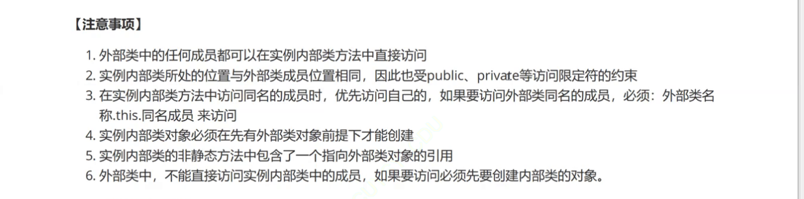
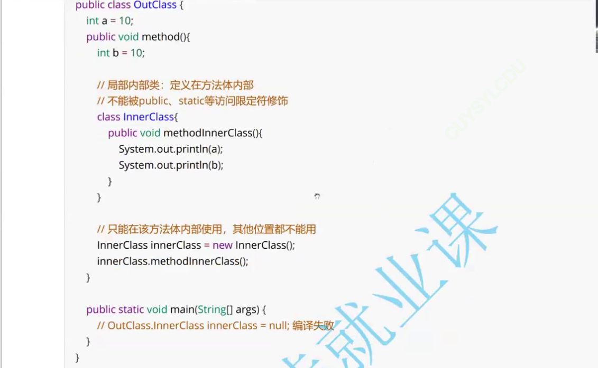

# 内部类


内部类和外部类共用一个Java源文件，但是经过编译后，内部类会形成单独的字节码文件


```java
class OuterClass{
    public int data1 = 10;
    public int data2 = 20;
    public static int data3 = 30;

    /*实例内部类
     *1.如何实例化内部类对象？
     *
     *2.在实例内部类中，不能定义静态的成员变量
     */
    class InnerClass{
        public int data1 = 100;
        public int data4 = 40;
        private int data5 = 50;
        //public static int data6 = 60;  静态不依赖对象
        public static final int data6 = 60;//修饰的常量，常量在编译的时候就已经确定

        public void testInner(){
            System.out.println("testInner");
            System.out.println(OuterClass.this.data1);//访问外部类的data1
        }
    }
}
class OuterClass2{
    public int data1 = 10;
    public int data2 = 20;
    public static int data3 = 30;

    /*
    静态内部类
    1.如何实例化静态内部类对象
    2.如何在静态内部类当中访问外部类的非静态成员
     */
    static class InnerClass2{

        public int data4 = 40;
        private int data5 = 50;
        public static int data6 = 60;

        public void testInner(){
            System.out.println("testInner()");
            OuterClass2 outerClass2 = new OuterClass2();
            System.out.println(outerClass2.data1);//如何在静态内部类当中访问外部类的非静态成员
            System.out.println(data4);
        }
    }
}

public class Test {
    public static void main(String[] args) {
        OuterClass2.InnerClass2 innerClass2 = new OuterClass2.InnerClass2();//如何实例化静态内部类对象
        innerClass2.testInner();
    }

    public static void main1(String[] args) {
        OuterClass outerClass = new OuterClass();
        OuterClass.InnerClass innerClass = outerClass.new InnerClass();

        OuterClass.InnerClass innerClass1 = new OuterClass().new InnerClass();
        innerClass1.testInner();
    }
}

```

###### 实例内部类



###### 静态内部类


###### 局部内部类



