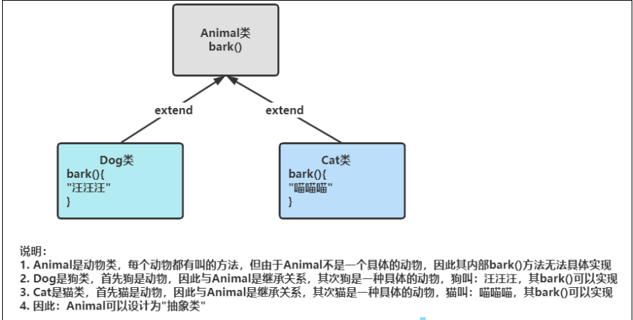

# 抽象类和接口

## 1.抽象类

###### 1.1抽象的概念

在面向对象的概念中，所有的对象都是通过类来描绘的，但是反过来，并不是所有的类都是用来描绘对象的，**如果一个类中没有包含足够的信息来描绘一个具体的对象，这样的类就是抽象类**



###### **1.2** **抽象类语法**

在Java中，一个类如果被 abstract 修饰称为抽象类，抽象类中被 abstract 修饰的方法称为抽象方法，抽象方法不用给出具体的实现体。

```java
// 抽象类：被abstract修饰的类
public abstract class Shape {
// 抽象方法：被abstract修饰的方法，没有方法体
  abstract public void draw();
  abstract void calcArea();
// 抽象类也是类，也可以增加普通方法和属性
  public double getArea(){
  return area;
  }
  protected double area; // 面积
}
```

###### 1.3抽象类特性

1. ------

   抽象类和抽象方法都是使用abstract修饰

2. 抽象类不能进行实例化，但是普通类可以

3. 抽象类当中不一定包含抽象方法，但是包含抽象方法的类一定是抽象类

4. 抽象类当中可以定义成员变量和成员方法

5. 当一个普通类 继承我们的 抽象类，此时在普通类一定要重写抽象类中的抽象方法

6. 抽象类存在的最大意义就是为了被继承

7. 当一个抽象类A继承一个抽象类B，此时抽象类A不需要重写抽象类B的中的成员。但当一个普通类C继承了抽象类A，此时就需要重写所有没有被重写的抽象方法

8. 一定要满足重写的要求

9. final关键字不可能同时作用在一个方法和类上

10. 抽象类当中可以存在构造方法，在子类实例化时，会帮助父类成员进行初始化

    ------

    

###### 1.4抽象类的作用


## 2.接口

###### 2.1接口的概念

：**接口就是公共的行为规范标准，大家在实现时，只要符合规范标准，就可以通用**。

**在Java中，接口可以看成是：多个类的公共规范，是一种引用数据类型。**

------

###### 2.2语法规则

接口的定义格式与定义类的格式基本相同，将class关键字换成 interface 关键字，就定义了一个接口。

```java
public interface 接口名称{
// 抽象方法
  public abstract void method1(); // public abstract 是固定搭配，可以不写
  public void method2();
  abstract void method3();
  void method4();
// 注意：在接口中上述写法都是抽象方法，跟推荐方式4，代码更简洁
创建接口时, 接口的命名一般以大写字母 I 开头.
```


------

###### 2.3接口使用

**接口不能直接使用，必须要有一个实现类来实现该接口，实现接口中的所有抽象方法。**

```
public class 类名称 implements 接口名称{
// ...
}
```

注意：子类和父类之间是extends 继承关系，类与接口之间是 implements 实现关系。


------

###### 2.4接口的特性

1. 接口类型是一种引用类型，但是不能直接new接口的对象

```
public class TestUSB {
  public static void main(String[] args) {
    USB usb = new USB();
  }
}
// Error:(10, 19) java: day20210915.USB是抽象的; 无法实例化
```

2. 接口中每一个方法都是public的抽象方法, 即接口中的方法会被隐式的指定为 **public abstract**（只能是

public abstract，其他修饰符都会报错)

```
public interface USB {
// Error:(4, 18) java: 此处不允许使用修饰符private
  private void openDevice();
  void closeDevice();
}
```

3. 接口中的方法是不能在接口中实现的，只能由实现接口的类来实现

```
public interface USB {
  void openDevice();
// 编译失败：因为接口中的方式默认为抽象方法
// Error:(5, 23) java: 接口抽象方法不能带有主体
  void closeDevice(){
  System.out.println("关闭USB设备");
  }
}
```

4.子类实现接口方法的时候，这个方法一定要是public修饰的

5.接口中可以含有变量，但是接口中的变量会被隐式的指定为 **public static final** 变量

```
public interface USB {
  double brand = 3.0; // 默认被：final public static修饰
  void openDevice();
  void closeDevice();
}
public class TestUSB {
  public static void main(String[] args) {
    System.out.println(USB.brand); // 可以直接通过接口名访问，说明是静态的
    
// 编译报错：Error:(12, 12) java: 无法为最终变量brand分配值
    USB.brand = 2.0; // 说明brand具有final属性
  }
}
```

6.接口中不能有静态代码块和构造方法

7.接口虽然不是类，但是接口编译完成后字节码文件的后缀格式也是.class

8.如果类没有实现接口中的所有的抽象方法，则类必须设置为抽象类

9.jdk8中：接口中还可以包含default方法。

------

###### 2.5实现多个接口

在Java中，类和类之间是单继承的，一个类只能有一个父类，即**Java**中不支持多继承**，但是**一个类可以实现多个接口。

**注意：一个类实现多个接口时，每个接口中的抽象方法都要实现，否则类必须设置为抽象类**。

提示, IDEA 中使用 ctrl + i 快速实现接口


 Java 面向对象编程中最常见的用法: 一个类继承一个父类, 同时实现多种接口.

继承表达的含义是 is - a 语义, 而接口表达的含义是 具有 x xx 特性 .

猫是一种动物, 具有会跑的特性.

青蛙也是一种动物, 既能跑, 也能游泳

鸭子也是一种动物, 既能跑, 也能游, 还能飞

这样设计有什么好处呢? 时刻牢记多态的好处, 让程序猿**忘记类型**. 有了接口之后, 类的使用者就不必关注具体类型,

而只关注某个类是否具备某种能力.


------

###### 2.6接口间的继承

在Java中，类和类之间是单继承的，一个类可以实现多个接口，接口与接口之间可以多继承。即：用接口可以达到

多继承的目的。

接口可以继承一个接口, 达到复用的效果. 使用 extends 关键字

```
interface IRunning {
  void run();
}
interface ISwimming {
  void swim();
}
// 两栖的动物, 既能跑, 也能游
interface IAmphibious extends IRunning, ISwimming {
 }
class Frog implements IAmphibious {
  ...
}
```

通过接口继承创建一个新的接口 IAmphibious 表示 "两栖的". 此时实现接口创建的 Frog 类, 就继续要实现 run 方

法, 也需要实现 swim 方法.

接口间的继承相当于把多个接口合并在一起.


###### 2.7 **接口使用实例**

让我们的 Student 类实现 Comparable 接口, 并实现其中的 compareTo 方法

```
class Student implements Comparable {

  private String name;
  private int score;
  public Student(String name, int score) {
    this.name = name;
    this.score = score;
  }
  
  @Override
  public String toString() {
    return "[" + this.name + ":" + this.score + "]";
  }
  
  @Override
  public int compareTo(Object o) {
    Student s = (Student)o;
    if (this.score > s.score) {
      return -1;
    } else if (this.score < s.score) {
      return 1;
    } else {
       return 0;
    }
  }
}
```

在 sort 方法中会自动调用 compareTo 方法. compareTo 的参数是 Object , 其实传入的就是 Student 类型的对象

然后比较当前对象和参数对象的大小关系(按分数来算).

- 如果当前对象应排在参数对象之前, 返回小于 0 的数字;
- 如果当前对象应排在参数对象之后, 返回大于 0 的数字;
- 如果当前对象和参数对象不分先后, 返回 0;

------

###### 2.8 Clonable接口和深拷贝

Object 类中存在一个 clone 方法, 调用这个方法可以创建一个对象的 "拷贝". 但是要想合法调用 clone 方法, 必须要

先实现 Clonable 接口, 否则就会抛出 CloneNotSupportedException 异常.

Clonable 拷贝出的对象是一份 "浅拷贝"

```
class Money {
  public double m = 99.99;
}

class Person implements Cloneable{
  public Money money = new Money();
  @Override
  protected Object clone() throws CloneNotSupportedException {
    return super.clone();
  }
}

  public class TestDemo3 {
    public static void main(String[] args) throws CloneNotSupportedException {
    Person person1 = new Person();
    Person person2 = (Person) person.clone();
    System.out.println("通过person2修改前的结果");
    System.out.println(person1.money.m);
    System.out.println(person2.money.m);
    person2.money.m = 13.6;
    System.out.println("通过person2修改后的结果");
    System.out.println(person1.money.m);
    System.out.println(person2.money.m);
  }
}
// 执行结果
通过person2修改前的结果
99.99
99.99
通过person2修改后的结果
13.6
13.6
```

如上代码，我们可以看到，通过clone，我们只是拷贝了Person对象。但是Person对象中的Money对象，并

没有拷贝。通过person2这个引用修改了m的值后，person1这个引用访问m的时候，值也发生了改变。这里

就是发生了浅拷贝。

## 3.抽象类和接口的区别

**核心区别**: 抽象类中可以包含普通方法和普通字段, 这样的普通方法和字段可以被子类直接使用(不必重写), 而接口中不能包含普通方法, 子类必须重写所有的抽象方法


###### A:成员的区别

抽象类：
构造方法：有构造方法，用于子类实例化使用。
成员变量：可以是变量，也可以是常量。
成员方法：可以是抽象的，也可以是非抽象的。

接口：
构造方法：没有构造方法
成员变量：只能是常量。默认修饰符：public static final
成员方法：jdk1.7只能是抽象的。默认修饰符：public abstract (推荐：默认修饰符请自己永远手动给出)
jdk1.8可以写以default和static开头的具体方法

###### B:类和接口的关系区别

类与类：
继承关系,只能单继承。可以多层继承。

类与接口：
实现关系,可以单实现,也可以多实现。
类还可以在继承一个类的同时实现多个接口。

接口与接口：
继承关系,可以单继承,也可以多继承。

###### C:体现的理念不同

抽象类里面定义的都是一个继承体系中的共性内容。
接口是功能的集合,是一个体系额外的功能，是暴露出来的规则。

## 3. Object类

###### 3.1

Object是Java默认提供的一个类。Java里面除了Object类，所有的类都是存在继承关系的。默认会继承Object父

类。即所有类的对象都可以使用Object的引用进行接收。

**范例：使用Object接收所有类的对象**

```
class Person{}
class Student{}

public class Test {
  public static void main(String[] args) {
    function(new Person());
    function(new Student());
  }
  public static void function(Object obj) {
    System.out.println(obj);
  }
}
//执行结果：
Person@1b6d3586
Student@4554617c
```

所以在开发之中，Object类是参数的最高统一类型。但是Object类也存在有定义好的一些方法。如下：


###### 3.2获取对象信息

如果要打印对象中的内容，可以直接重写Object类中的toString()方法

```
// Object类中的toString()方法实现：

public String toString() {
  return getClass().getName() + "@" + Integer.toHexString(hashCode());
}
```

###### 3.3对象比较equals方法

在Java中，==进行比较时：

a.如果==左右两侧是基本类型变量，比较的是变量中值是否相同

b.如果==左右两侧是引用类型变量，比较的是引用变量地址是否相同

c.如果要比较对象中内容，必须重写Object中的equals方法，因为equals方法默认也是按照地址比较的：

```
// Object类中的equals方法
public boolean equals(Object obj) {
  return (this == obj); // 使用引用中的地址直接来进行比较
}
```

```
class Person{
  private String name ;
  private int age ;
  public Person(String name, int age) {
    this.age = age ;
    this.name = name ;
  }
}

public class Test {
  public static void main(String[] args) {
    Person p1 = new Person("gaobo", 20) ;
    Person p2 = new Person("gaobo", 20) ;
    int a = 10;
    int b = 10;
    System.out.println(a == b); // 输出true
    System.out.println(p1 == p2); // 输出false
    System.out.println(p1.equals(p2)); // 输出false
  }
}
```

Person类重写equals方法后，然后比较：

```
class Person{
  ...
  @Override
  public boolean equals(Object obj) {
    if (obj == null) {
    return false ;
    }
    
    if(this == obj) {
      return true ;
    }
    
// 不是Person类对象
    if (!(obj instanceof Person)) {
      return false ;
    }
    
    Person person = (Person) obj ; // 向下转型，比较属性值
    return this.name.equals(person.name) && this.age==person.age ;
  }
}
```

**结论：比较对象中内容是否相同的时候，一定要重写equals方法。**

------

###### 3.3 hashcode方法


```java
class Person {
  public String name;
  public int age;
  public Person(String name, int age) {
    this.name = name;
    this.age = age;
  }
}
public class TestDemo4 {
  public static void main(String[] args) {
  Person per1 = new Person("gaobo", 20) ;
  Person per2 = new Person("gaobo", 20) ;
  System.out.println(per1.hashCode());
  System.out.println(per2.hashCode());
  }
}
//执行结果
460141958
1163157884
```

**注意事项：两个对象的hash值不一样**

像重写equals方法一样，我们也可以重写hashcode()方法。此时我们再来看看。

```
class Person {
  public String name;
  public int age;
  
  public Person(String name, int age) {
    this.name = name;
    this.age = age;
  }
  @Override
  public int hashCode() {
    return Objects.hash(name, age);
  }
}

public class TestDemo4 {
  public static void main(String[] args) {
    Person per1 = new Person("gaobo", 20) ;
    Person per2 = new Person("gaobo", 20) ;
    System.out.println(per1.hashCode());
    System.out.println(per2.hashCode());
  }
}
//执行结果
460141958
460141958
```

注意事项：哈希值一样。

结论：

1、hashcode方法用来确定对象在内存中存储的位置是否相同

2、事实上hashCode() 在散列表中才有用，在其它情况下没用。在散列表中hashCode() 的作用是获取对象的

散列码，进而确定该对象在散列表中的位置。