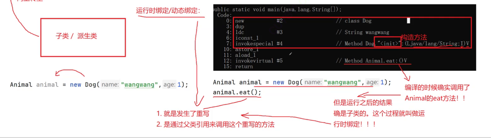
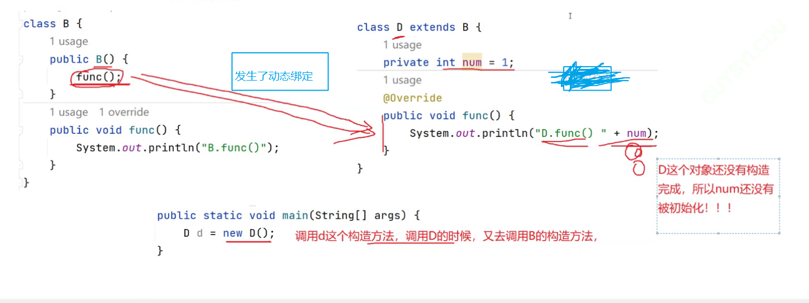

# 继承和多态

## 1.继承

###### 1.1为什么需要继承

代码类中存在大量重复，继承用来进行共性抽取，实现代码复用

###### 1.2继承的概念

继承机制：是面向对象程序设计使代码可以复用的最重要的手段，它允许程序员在保持原有类特 性的基础上进行**扩展，增加新功能**，这样产生新的类，称**派生类**。

继承最大的作用就是：实现代码复用，还有就是来实现多态

###### 1.3继承的语法

在Java中如果要表示类之间的继承关系，需要借助**extends**关键字

```java
修饰符 class 子类 extends 父类 {
// ... 
}
```

```java
public class Animal{
  String name;
  int age;
  public void eat(){
  System.out.println(name + "正在吃饭");
 }
  public void sleep(){
  System.out.println(name + "正在睡觉");
 }
}

public class Dog extends Animal{
 void bark(){
   System.out.println(name + "汪汪汪~~~");
 }  
}
public class Cat extends Animal{
void mew(){
System.out.println(name + "喵喵喵~~~");
}
}

public class TestExtend {
  public static void main(String[] args) {
    Dog dog = new Dog();
// dog类中并没有定义任何成员变量，name和age属性肯定是从父类Animal中继承下来的
    System.out.println(dog.name);
    System.out.println(dog.age);
// dog访问的eat()和sleep()方法也是从Animal中继承下来的
    dog.eat();
    dog.sleep();
    dog.bark();
   }
}
```

1. 子类会将父类中的成员变量或者成员方法继承到子类中了

2. 子类继承父类之后，必须要新添加自己特有的成员，体现出与基类的不同，否则就没有必要继承了

###### 1.4父类成员访问

**在子类方法中 或者 通过子类对象访问成员时**：

- 如果访问的成员变量子类中有，优先访问自己的成员变量。
- 如果访问的成员变量子类中无，则访问父类继承下来的，如果父类也没有定义，则编译报错。
- 如果访问的成员变量与父类中成员变量同名，则优先访问自己的

**子类中访问父类的成员方法**

- 通过子类对象访问父类与子类中不同名方法时，优先在子类中找，找到则访问，否则在父类中找，找到则访问，否则编译报错。
- 通过派生类对象访问父类与子类同名方法时，如果父类和子类同名方法的参数列表不同(重载)，根据调用方法适传递的参数选择合适的方法访问，如果没有则报错

###### 1.5 super关键字

**主要作用：在子类方法中访问父类的成员**。

```java
public class Base {
  int a;
  int b;
 public void methodA(){
   System.out.println("Base中的methodA()");
 }
 public void methodB(){
   System.out.println("Base中的methodB()");
 }
}

public class Derived extends Base{
  int a; // 与父类中成员变量同名且类型相同
  char b; // 与父类中成员变量同名但类型不同
// 与父类中methodA()构成重载
 public void methodA(int a) {
   System.out.println("Derived中的method()方法");
 }
// 与基类中methodB()构成重写(即原型一致，重写后序详细介绍)
 public void methodB(){
   System.out.println("Derived中的methodB()方法");
 }
 public void methodC(){
// 对于同名的成员变量，直接访问时，访问的都是子类的
   a = 100; // 等价于： this.a = 100;
   b = 101; // 等价于： this.b = 101;
// 注意：this是当前对象的引用
// 访问父类的成员变量时，需要借助super关键字
// super是获取到子类对象中从基类继承下来的部分
   super.a = 200;
   super.b = 201;
// 父类和子类中构成重载的方法，直接可以通过参数列表区分清访问父类还是子类方法
   methodA(); // 没有传参，访问父类中的methodA()
   methodA(20); // 传递int参数，访问子类中的methodA(int)
// 如果在子类中要访问重写的基类方法，则需要借助super关键字
   methodB(); // 直接访问，则永远访问到的都是子类中的methodA()，基类的无法访问到
   super.methodB(); // 访问基类的methodB()
 }
}
```

###### 1.6子类构造方法

子类对象构造时，需要先调用基类构造方法，然后执行子类的构造方法。

1.  若父类显式定义无参或者默认的构造方法，在子类构造方法第一行默认有隐含的super()调用，即调用基类造方法
2. 如果父类构造方法是带有参数的，此时需要用户为子类显式定义构造方法，并在子类构造方法中选择合适的父类构造方法调用，否则编译失败。
3. 在子类构造方法中，super(...)调用父类构造时，必须是子类构造函数中第一条语句。
4.  super(...)只能在子类构造方法中出现一次，并且不能和this同时出现

###### 1.7 super和this

【**相同点**】

\1. 都是Java中的关键字

\2. 只能在类的非静态方法中使用，用来访问非静态成员方法和字段

\3. 在构造方法中调用时，必须是构造方法中的第一条语句，并且不能同时存在

【**不同点**】

\1. this是当前对象的引用，当前对象即调用实例方法的对象，super相当于是子类对象中从父类继承下来部分成

员的引用

\2. 在非静态成员方法中，this用来访问本类的方法和属性，super用来访问父类继承下来的方法和属性

\3. 在构造方法中：this(...)用于调用本类构造方法，super(...)用于调用父类构造方法，两种调用不能同时在构造方法中出现

\4. 构造方法中一定会存在super(...)的调用，用户没有写编译器也会增加，但是this(...)用户不写则没有

###### 1.8继承方式

**注意：Java中不支持多继承**。

时刻牢记, 我们写的类是现实事物的抽象. 而我们真正在公司中所遇到的项目往往业务比较复杂, 可能会涉及到一系列复杂的概念, 都需要我们使用代码来表示, 所以我们真实项目中所写的类也会有很多. 类之间的关系也会更加复杂.

但是即使如此, 我们并不希望类之间的继承层次太复杂. **一般我们不希望出现超过三层的继承关系**. 如果继承层次太多, 就需要考虑对代码进行重构了.

如果想从语法上进行限制继承, 就可以使用 final 关键字

###### 1.9 final关键字

final关键可以用来修饰变量、成员方法以及类。

1. **修饰变量或字段，表示常量(即不能修改)**

```java
final int a = 10;
a = 20; // 编译出错
```

2. **修饰类：表示此类不能被继承**

```java
final public class Animal {
  ...
}
public class Bird extends Animal {
  ...
}
// 编译出错
Error:(3, 27) java: 无法从最终com.bit.Animal进行继承
```

3. **修饰方法：表示该方法不能被重写**

###### 1.10继承和组合

**继承表示对象之间是**is-a的关系，比如：狗是动物，猫是动物

**组合表示对象之间是**has-a的关系，比如：汽车

汽车和其轮胎、发动机、方向盘、车载系统等的关系就应该是组合，因为汽车是有这些部件组成的

```java
// 轮胎类
class Tire{
  // ...
}
// 发动机类
class Engine{
  // ...
}
// 车载系统类
class VehicleSystem{
  // ...
}
class Car{
  private Tire tire; // 可以复用轮胎中的属性和方法
  private Engine engine; // 可以复用发动机中的属性和方法
  private VehicleSystem vs; // 可以复用车载系统中的属性和方法
  // ...
}
// 奔驰是汽车
class Benz extend Car{
// 将汽车中包含的：轮胎、发送机、车载系统全部继承下来
}
```

组合和继承都可以实现代码复用，应该使用继承还是组合，需要根据应用场景来选择，一般建议：能用组合尽量用组合。

## 2.多态

###### 2.1 什么是多态？

多种形态，**具体点就是去完成某个行为，当不同的对象去完成时会产生出不同 的状态。**

需要理解：

**向上转型** 

------

向上转型：实际就是创建一个子类对象，将其当成父类对象来使用。

语法格式：父类类型 对象名 = new 子类类型()

Animal animal = new Cat("元宝",2);

animal是父类类型，但可以引用一个子类对象，因为是从小范围向大范围的转换。

- 向上转型的优点：让代码实现更简单灵活。
- 向上转型的缺陷：不能调用到子类特有的方法。

------

**向下转型**

------

将一个子类对象经过向上转型之后当成父类方法使用，再无法调用子类的方法，但有时候可能需要调用子类特有的

方法，此时：将父类引用再还原为子类对象即可，即向下转换。

```java
public class TestAnimal {
 public static void main(String[] args) {
   Cat cat = new Cat("元宝",2);
   Dog dog = new Dog("小七", 1);
// 向上转型
   Animal animal = cat;
   animal.eat();
   animal = dog;
   animal.eat();
// 向上转型
// 程序可以通过编程，但运行时抛出异常---因为：animal实际指向的是狗
// 现在要强制还原为猫，无法正常还原，运行时抛出：ClassCastException
   cat = (Cat)animal;
   cat.mew();
// animal本来指向的就是狗，因此将animal还原为狗也是安全的
   dog = (Dog)animal;
   dog.bark();
 }
}
```

```java
if(animal instanceof Cat){
  cat = (Cat)animal;
  cat.mew();
}
  if(animal instanceof Dog){
  dog = (Dog)animal;
  dog.bark();
}
```

instanceof  关键词官方介绍：https://docs.oracle.com/javase/specs/jls/se8/html/jls-15.html#jls-15.20.2

**方法的重写和重载区别**

------

重写：@override                                                                 重载：@overload

1.方法名称相同                                                                1.方法名称相同  

2.参数列表相同【个数，顺序，类型】                          2.参数列表不同【个数，顺序，类型】    

3.返回值类型相同                                                             3.返回值没有要求

（注：被private修饰的方法不能重写；

​            被static修饰方法不能重写；

​            子类的访问修饰限定符一定要大于等于父类的访问修饰限定符；

​             被final修饰的方法不能被重写）

------

**运行时绑定、编译时绑定**




在java中要实现多态，必须要满足如下几个条件，缺一不可：

1. **必须在继承体系下**

2. **子类必须要对父类中方法进行重写**

3. **通过父类的引用调用重写的方法**

**多态体现：在代码运行时，当传递不同类对象时，会调用对应类中的方法。**

###### 2.2多态的优点

【**使用多态的好处**】

1. **能够降低代码的"圈复杂度", 避免使用大量的if - else**

```java
public static void drawShapes() {
  Rect rect = new Rect();
  Cycle cycle = new Cycle();
  Flower flower = new Flower();
  String[] shapes = {"cycle", "rect", "cycle", "rect", "flower"};
 
  for (String shape : shapes) {
   if (shape.equals("cycle")) {
     cycle.draw();
    } else if (shape.equals("rect")) {
   rect.draw();
    } else if (shape.equals("flower")) {
  flower.draw();
  }
 }
}
```

如果使用使用多态, 则不必写这么多的 if - else 分支语句, 代码更简单

```java
public static void drawShapes() {
// 我们创建了一个 Shape 对象的数组.
  Shape[] shapes = {new Cycle(), new Rect(), new Cycle(),
  new Rect(), new Flower()};
  for (Shape shape : shapes) {
    shape.draw();
  }
}
```

2. **可扩展能力更强**

如果要新增一种新的形状, 使用多态的方式代码改动成本也比较低

```
class Triangle extends Shape {
  @Override
  public void draw() {
    System.out.println("△");
  }
}
```

对于类的调用者来说(drawShapes方法), 只要创建一个新类的实例就可以了, 改动成本很低.

而对于不用多态的情况, 就要把 drawShapes 中的 if - else 进行一定的修改, 改动成本更高.

**多态缺陷：代码的运行效率降低**。

1. 属性没有多态性

当父类和子类都有同名属性的时候，通过父类引用，只能引用父类自己的成员属性

###### 2.3**避免在构造方法中调用重写的方法**



构造 D 对象的同时, 会调用 B 的构造方法.

B 的构造方法中调用了 func 方法, 此时会触发动态绑定, 会调用到 D 中的 func

此时 D 对象自身还没有构造, 此时 num 处在未初始化的状态, 值为 0. 如果具备多态性，num的值应该是1.

所以在构造函数内，尽量避免使用实例方法，除了final和private方法。