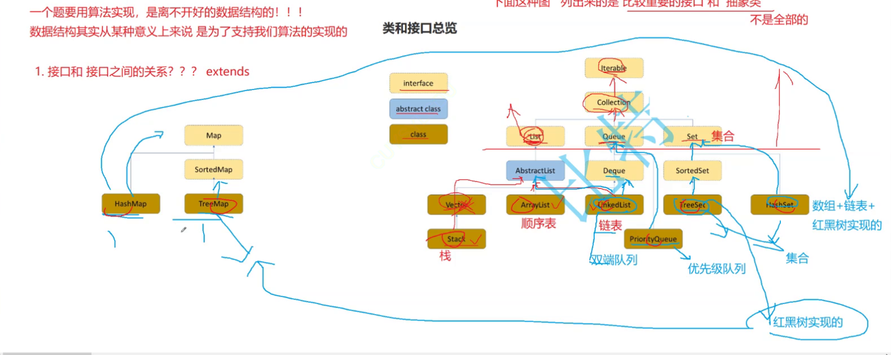

# **初识集合框架**

**目标】**

1. 什么是集合框架
2. 集合框架的重要性
3. 背后所涉及的数据结构

###### 1. 什么是集合框架

Java 集合框架 *Java Collection Framework* ，又被称为容器 *container* ，是定义在 *java.util* 包下的一组接口 *interfaces*和其实现类 *classes* 。

其主要表现为将多个元素 element 置于一个单元中，用于对这些元素进行快速、便捷的存储 store 、检索 retrieve 、管理 manipulate ，即平时我们俗称的增删查改 CRUD 。

**多个集合类组成的，集合类之间是具备一定关联的**

###### **2.** **集合框架的重要性**

- 使用成熟的集合框架，有助于我们便捷、快速的写出高效、稳定的代码
- 学习背后的数据结构知识，有助于我们理解各个集合的优缺点及使用场景

###### **3.** **背后所涉及的数据结构以及算法**

**3.1** **什么是数据结构**

数据结构(Data Structure)是计算机存储、组织数据的方式，指相互之间存在一种或多种特定关系的数据元素的

集合。

**3.2** **容器背后对应的数据结构**

该阶段，我们主要学习以下容器，每个容器其实都是对某种特定数据结构的封装，大概了解一下，后序会给大家详

细讲解并模拟实现：

\1. **Collection**：是一个接口，包含了大部分容器常用的一些方法

\2. **List**：是一个接口，规范了ArrayList 和 LinkedList中要实现的方法

- **ArrayList****：**实现了List接口，底层为动态类型顺序表
- **LinkedList**：实现了List接口，底层为双向链表

\3. **Stack**：底层是栈，栈是一种特殊的顺序表

\4. **Queue**：底层是队列，队列是一种特殊的顺序表

\5. **Deque**：是一个接口

\6. **Set**：集合，是一个接口，里面放置的是K模型

- **HashSet**：底层为哈希桶，查询的时间复杂度为O(1)
- **TreeSet**：底层为红黑树，查询的时间复杂度为O( log₂N),关于key有序的

\7. **Map**：映射，里面存储的是K-V模型的键值对

- **HashMap**：底层为哈希桶，查询时间复杂度为O(1)
- **TreeMap**：底层为红黑树，查询的时间复杂度为O(  log₂N)，关于key有序

**3.3** **相关java知识**

\1. 泛型 Generic

\2. 自动装箱 autobox 和自动拆箱 autounbox

\3. Object 的 equals 方法

\4. Comparable 和 Comparator 接口

**3.4** **什么是算法**

算法(Algorithm):就是定义良好的计算过程，他取一个或一组的值为输入，并产生出一个或一组值作为输出。简单

来说算法就是一系列的计算步骤，用来将输入数据转化成输出结果。