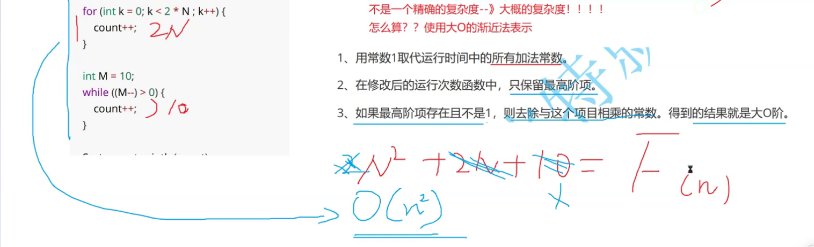
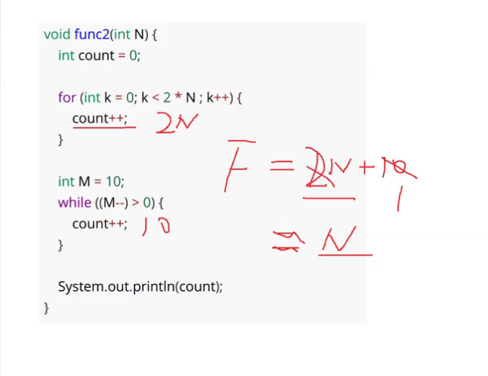
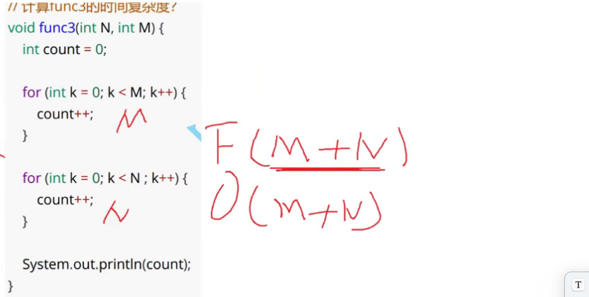
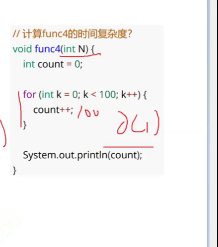
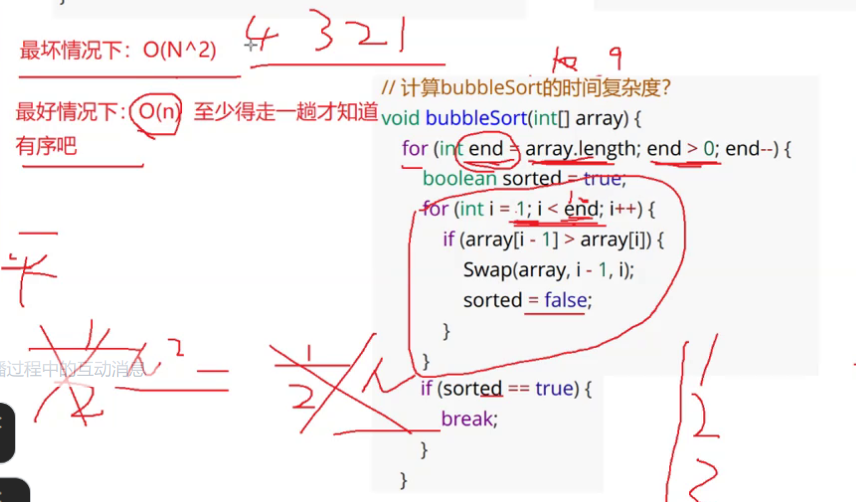
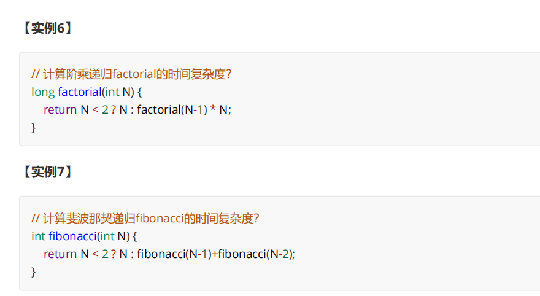
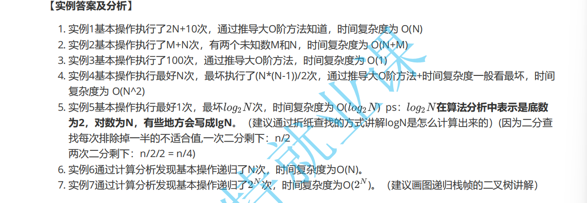

# **时间和空间复杂度**

**目标】**

1. **算法效率**

2. **时间复杂度**

3. **空间复杂度**

#### 1.算法效率

**算法效率分析分为两种：第一种是时间效率，第二种是空间效率**。**时间效率被称为时间复杂度，而空间效率被称作**

**空间复杂度**。 **时间复杂度主要衡量的是一个算法的运行速度，而空间复杂度主要衡量一个算法所需要的额外空间**，

在计算机发展的早期，计算机的存储容量很小。所以对空间复杂度很是在乎。但是经过计算机行业的迅速发展，计

算机的存储容量已经达到了很高的程度。所以我们如今已经不需要再特别关注一个算法的空间复杂度。

------

#### **2.** **时间复杂度**

###### 2.1 时间复杂度的概念

时间复杂度的定义：在计算机科学中，**算法的时间复杂度是一个数学函数**，它定量描述了该算法的运行时间。一个

算法执行所耗费的时间，从理论上说，是不能算出来的，只有你把你的程序放在机器上跑起来，才能知道。但是我

们需要每个算法都上机测试吗？是可以都上机测试，但是这很麻烦，所以才有了时间复杂度这个分析方式。一个算

法所花费的时间与其中语句的执行次数成正比例，**算法中的基本操作的执行次数，为算法的时间复杂度。**

###### 2.2 大O的渐进表示法

```
// 请计算一下func1基本操作执行了多少次？
void func1(int N){
  int count = 0;
  for (int i = 0; i < N ; i++) {
    for (int j = 0; j < N ; j++) {
    count++;
    }
  }
  
  for (int k = 0; k < 2 * N ; k++) {
    count++;
  }
  
  int M = 10;
  while ((M--) > 0) {
    count++;
  }
  System.out.println(count);
}
```

F(N) = N² + 2*N + 10

实际中我们计算时间复杂度时，我们其实并不一定要计算精确的执行次数，而只需要**大概执行次数，那么这里我们**

**使用大O的渐进表示法。**

大O符号（Big O notation）：是用于描述函数渐进行为的数学符号

###### 2.3 推导大O阶方法

1、用常数1取代运行时间中的所有加法常数。

2、在修改后的运行次数函数中，只保留最高阶项。

3、如果最高阶项存在且不是1，则去除与这个项目相乘的常数。得到的结果就是大O阶。

使用大O的渐进表示法以后，Func1的时间复杂度为：

​                                                                                          O（N²）



另外有些算法的时间复杂度存在最好、平均和最坏情况：

最坏情况：任意输入规模的最大运行次数(上界)

平均情况：任意输入规模的期望运行次数

最好情况：任意输入规模的最小运行次数(下界)

例如：在一个长度为N数组中搜索一个数据x

最好情况：1次找到

最坏情况：N次找到

平均情况：N/2次找到

**在实际中一般情况关注的是算法的最坏运行情况，所以数组中搜索数据时间复杂度为O(N)**

###### 2.4 常见时间复杂度计算举例









```
// 计算binarySearch的时间复杂度？
int binarySearch(int[] array, int value) {
  int begin = 0;
  int end = array.length - 1;
  while (begin <= end) {
    int mid = begin + ((end-begin) / 2);
    if (array[mid] < value)
        begin = mid + 1;
    else if (array[mid] > value)
        end = mid - 1;
    else
        return mid;
    }
    return -1;
}
```





#### 3. 空间复杂程度

空间复杂度是对一个算法在运行过程中**临时占用存储空间大小的量度** 。空间复杂度不是程序占用了多少bytes的空

间，因为这个也没太大意义，所以空间复杂度算的是变量的个数。空间复杂度计算规则基本跟时间复杂度类似，也

使用**大O渐进表示法**。