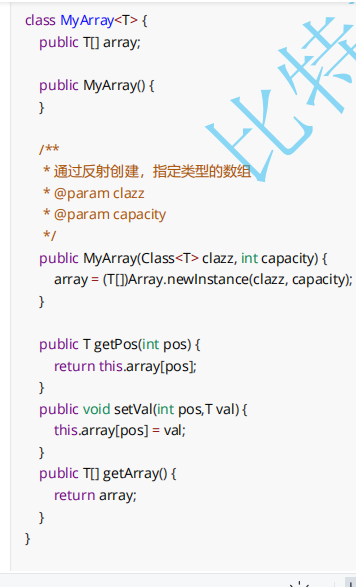

# **包装类&简单认识泛型**

**目标】**

\1. **以能阅读** **java** **集合源码为目标学习泛型**

\2. **了解包装类**

\3. **了解泛型**

------

#### 1 包装类

在Java中，由于基本类型不是继承自Object，为了在泛型代码中可以支持基本类型，Java给每个基本类型都对应了一个包装类型。

###### 1.1 基本数据类型和对应的包装类

| 基本数据类型 |  包装类   |
| :----------: | :-------: |
|     byte     |   Byte    |
|    short     |   Short   |
|     int      |  Integer  |
|     long     |   Long    |
|    float     |   Float   |
|    double    |  Double   |
|     char     | Character |
|   boolean    |  Boolean  |

###### 1.2 装箱与拆箱

```java
public class Test{
    public static void main(String[] args){
        int a = 10;
        Integer i = a;//自动装箱
        Integer iii = Integer.valueOf;//显示装箱
        Integer ii = new Integer;//显示装箱
        
        // 拆箱操作，将 Integer 对象中的值取出，放到一个基本数据类型中
        int j = ii.intValue();
    }

}
可以看到在使用过程中，装箱和拆箱带来不少的代码量，所以为了减少开发者的负担，java 提供了自动机制。
int i = 10;
Integer ii = i; // 自动装箱
Integer ij = (Integer)i; // 自动装箱
int j = ii; // 自动拆箱
int k = (int)ii; // 自动拆箱
```

------

#### 2 泛型

###### 2.1 什么是泛型

一般的类和方法，只能使用具体的类型: 要么是基本类型，要么是自定义的类。如果要编写可以应用于多种类型的

代码，这种刻板的限制对代码的束缚就会很大。----- 来源《Java编程思想》对泛型的介绍。

泛型是在 JDK1.5 引入的新的语法，通俗讲，泛型：**就是适用于许多许多类型**。从代码上讲，就是对类型实现了参数化。


###### 2.2 引出泛型

实现一个类，类中包含一个数组成员，使得数组中可以存放任何类型的数据，也可以根据成员方法返回数组中某个

下标的值？

思路：

1. 我们以前学过的数组，只能存放指定类型的元素，例如：int[] array = new int[10]; String[] strs = new

String[10];

2. 所有类的父类，默认为Object类。数组是否可以创建为Object?

```
class MyArray {
  public Object[] array = new Object[10];
  
  public Object getPos(int pos) {
    return this.array[pos];
  }
  
  public void setVal(int pos,Object val) {
    this.array[pos] = val;
  }
}

public class TestDemo {
  public static void main(String[] args) {
    MyArray myArray = new MyArray();
    myArray.setVal(0,10);
    myArray.setVal(1,"hello");//字符串也可以存放
    
    String ret = myArray.getPos(1);//编译报错
    String ret = (String)myArray.getPos(1);//强制类型转换
    
    System.out.println(ret);
  }
}
```

问题：以上代码实现后 发现

1. 任何类型数据都可以存放

2. 1号下标本身就是字符串，但是确编译报错。必须进行强制类型转换

虽然在这种情况下，当前数组任何数据都可以存放，但是，更多情况下，我们还是希望他只能够持有一种数据类

型。而不是同时持有这么多类型。**所以，泛型的主要目的：就是指定当前的容器，要持有什么类型的对象。让编译器去做检查。**此时，就需要把类型，作为参数传递。需要什么类型，就传入什么类型。


###### 2.3 语法

```
class 泛型类名称<类型形参列表> {
// 这里可以使用类型参数
}
class ClassName<T1, T2, ..., Tn> {
}

class 泛型类名称<类型形参列表> extends 继承类/* 这里可以使用类型参数 */ {
// 这里可以使用类型参数
}
class ClassName<T1, T2, ..., Tn> extends ParentClass<T1> {
// 可以只使用部分类型参数
}
```

```
class MyArray<T> {
  public T[] array = (T[])new Object[10];//1
  public T getPos(int pos) {
    return this.array[pos];
  }
  
  public void setVal(int pos,T val) {
    this.array[pos] = val;
  }
}
public class TestDemo {
  public static void main(String[] args) {
    MyArray<Integer> myArray = new MyArray<>();//2
    myArray.setVal(0,10);
    myArray.setVal(1,12);
    int ret = myArray.getPos(1);//3
    System.out.println(ret);
    myArray.setVal(2,"bit");//4
  }
}
```

1. 类名后的 <T> 代表占位符，表示当前类是一个泛型类

**了解：** 【规范】类型形参一般使用一个大写字母表示，常用的名称有：

E 表示 Element

K 表示 Key

V 表示 Value

N 表示 Number

T 表示 Type

S, U, V 等等 - 第二、第三、第四个类型


2. 注释1处，不能new泛型类型的数组

T[] ts = new T[5];//是不对的

**当中的代码：T[] array = (T[])new Object[10];是否就足够好，答案是未必的。这块问题一会儿介绍。**

3. 注释2处，类型后加入 <Integer> 指定当前类型

4. 注释3处，不需要进行强制类型转换

5. 注释4处，代码编译报错，此时因为在注释2处指定类当前的类型，此时在注释4处，编译器会在存放元素的时候帮助我们进行类型检查。

------

#### 3 泛型类的使用

###### 3.1 语法

泛型类<类型实参> 变量名; // 定义一个泛型类引用

new 泛型类<类型实参>(构造方法实参); // 实例化一个泛型类对象

###### 3.2 示例

```
MyArray<Integer> list = new MyArray<Integer>();
```

**注意：泛型只能接受类，所有的基本数据类型必须使用包装类！**

###### 3.3 类型推导

当编译器可以根据上下文推导出类型实参时，可以省略类型实参的填写

```
MyArray<Integer> list = new MyArray<>(); // 可以推导出实例化需要的类型实参为 Integer
```

------

#### 4 **裸类型(Raw Type)（了解）**

###### 4.1 说明

裸类型是一个泛型类但没有带着类型实参，例如 MyArrayList 就是一个裸类型

```
MyArray list = new MyArray()；
```

**注意：** 我们不要自己去使用裸类型，裸类型是为了兼容老版本的 API 保留的机制

下面的类型擦除部分，我们也会讲到编译器是如何使用裸类型的。

**小结：**

1. 泛型是将数据类型参数化，进行传递

2. 使用 <T> 表示当前类是一个泛型类。

3. 泛型目前为止的优点：数据类型参数化，编译时自动进行类型检查和转换

------

#### 5 泛型如何编译的

###### 5.1 擦除机制


在编译的过程当中，将所有的T替换为Object这种机制，我们称为：**擦除机制**。

Java的泛型机制是在编译级别实现的。编译器生成的字节码在运行期间并不包含泛型的类型信息。

有关泛型擦除机制的文章截介绍：https://zhuanlan.zhihu.com/p/51452375

提出问题：

1、那为什么，T[] ts = new T[5]; 是不对的，编译的时候，替换为Object，不是相当于：Object[] ts = new

Object[5]吗？

2、类型擦除，一定是把T变成Object吗？


###### 5.2 为什么不能实例化泛型类型数组

```
class MyArray<T> {
  public T[] array = (T[])new Object[10];
  
  public T getPos(int pos) {
    return this.array[pos];
  }
  public void setVal(int pos,T val) {
    this.array[pos] = val;
  }
  public T[] getArray() {
    return array；
    }
}

public static void main(String[] args) {
  MyArray<Integer> myArray1 = new MyArray<>();
  Integer[] strings = myArray1.getArray();
}
/*
Exception in thread "main" java.lang.ClassCastException: [Ljava.lang.Object; cannot be cast to [Ljava.lang.Integer;
at TestDemo.main(TestDemo.java:31)
*/
```

原因：替换后的方法为：将Object[]分配给Integer[]引用，程序报错。

```java
public Object[] getArray() {
  return array;
}
```

通俗讲就是：返回的Object数组里面，可能存放的是任何的数据类型，可能是String，可能是Person，运行的时候，直接转给Integer类型的数组，编译器认为是不安全的

正确的方式：**【了解即可】**



**实际开发过程中做的**


------

#### 6 泛型的上界

在定义泛型类时，有时需要对传入的类型变量做一定的约束，可以通过类型边界来约束。

###### 6.1 语法

```
class 泛型类名称<类型形参 extends 类型边界> {
 ...
}
```

###### 6.2 示例


###### 6.3 复杂示例

```
public class MyArray<E extends Comparable<E>> {

...

}
```

E必须是实现了Comparable接口的


------

#### 7 泛型方法

7.1 定义语法

```
方法限定符 <类型形参列表> 返回值类型 方法名称(形参列表) { ... }
```

7.2 示例

```
public class Util {
  //静态的泛型方法 需要在static后用<>声明泛型类型参数
  public static <E> void swap(E[] array, int i, int j) {
    E t = array[i];
    array[i] = array[j];
    array[j] = t;
  }
}
```

