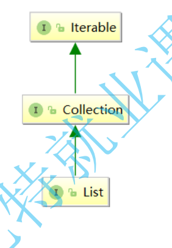
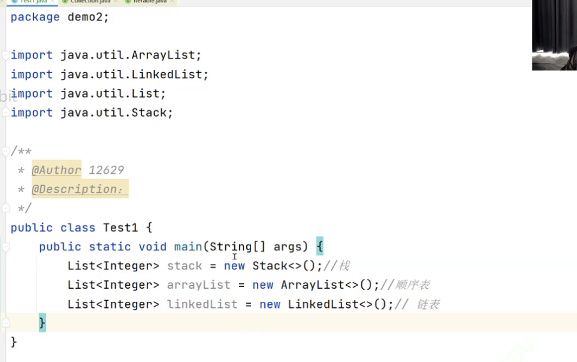
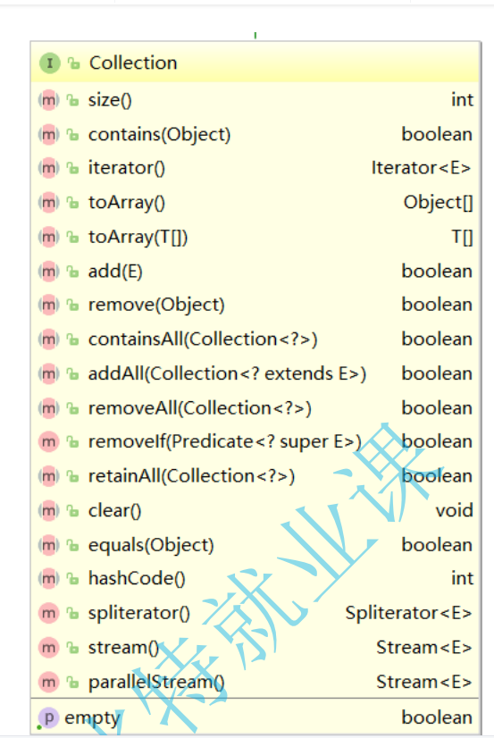
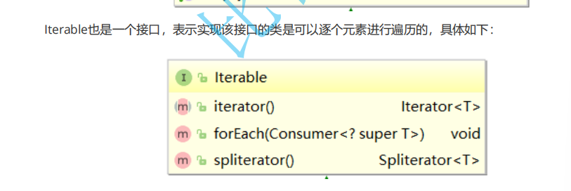
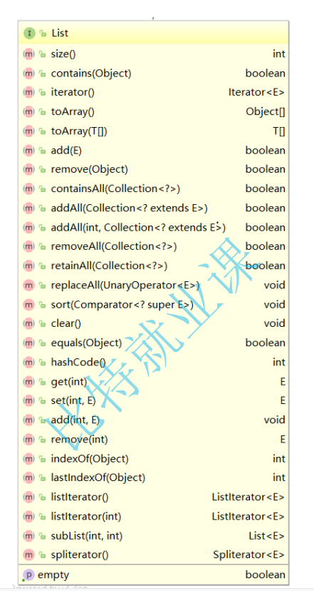
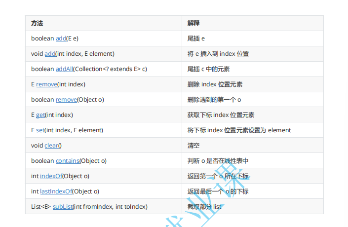

# List的介绍

###### 1 什么是List

在集合框架中，**List是一个接口，继承自Collection**。

**Collection也是一个接口**，该接口中规范了后序容器中常用的一些方法，具体如下所示：

站在数据结构的角度来看，**List就是一个线性表，即n个具有相同类型元素的有限序列，在该序列上可以执行增删**

**改查以及变量等操作**。

------

###### **2.** **常见接口介绍**

List中提供了好的方法，具体如下：

虽然方法比较多，但是常用方法如下：

------

###### **3. List的使用**

注意：**List是个接口，并不能直接用来实例化**

如果要使用，必须去实例化List的实现类。在集合框架中，**ArrayList和LinkedList都实现了List接口**。