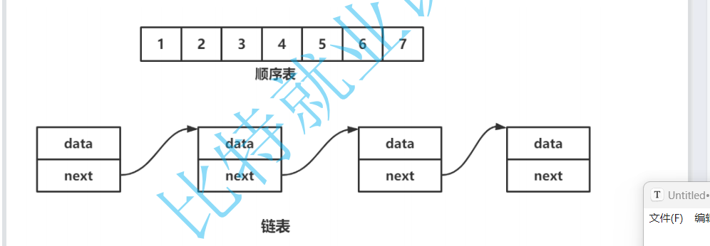
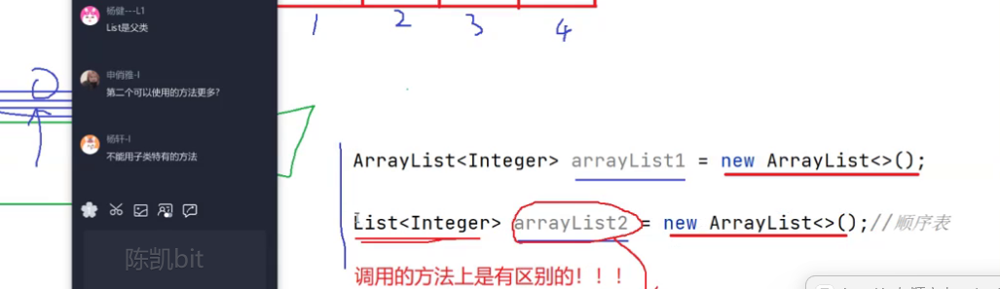
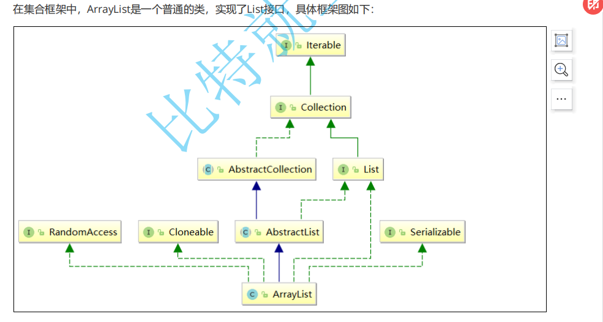
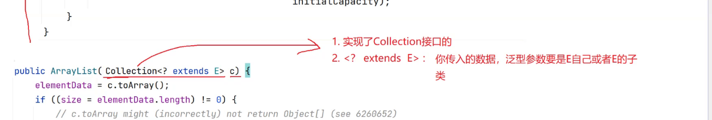
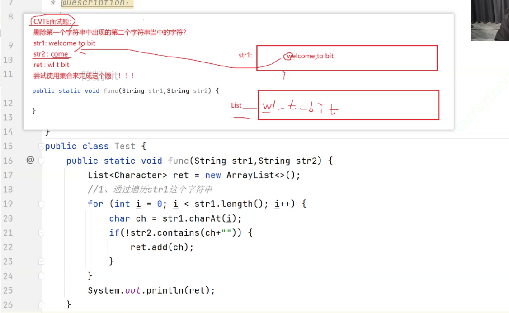
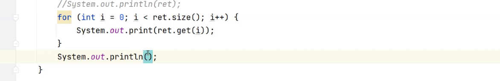
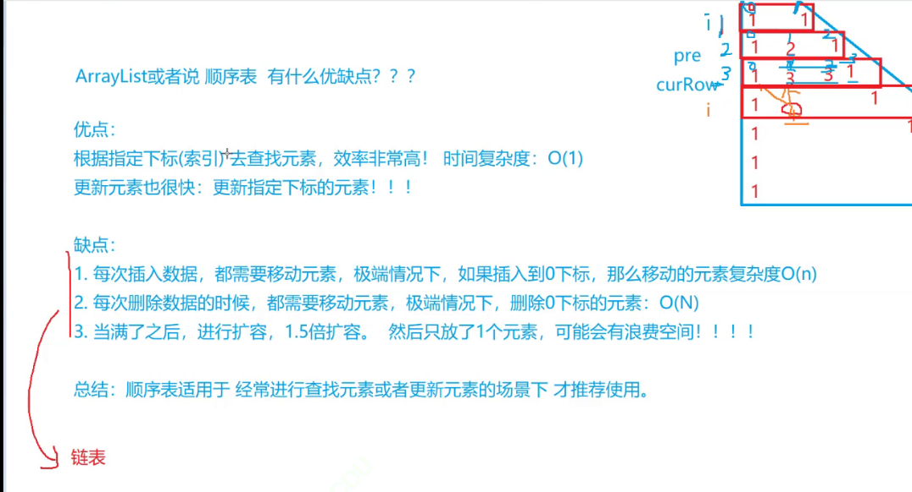

# ArrayList与顺序表

1. **线性表**

2. **顺序表**

3. **ArrayList的简介**

4. **ArrayList使用**

5. **ArrayList的扩容机制**

6. **扑克牌**

------

#### 1 线性表

线性表（*linear list*）是n个具有相同特性的数据元素的有限序列。 线性表是一种在实际中广泛使用的数据结

构，常见的线性表：顺序表、链表、栈、队列...

线性表在逻辑上是线性结构，也就说是连续的一条直线。但是在物理结构上并不一定是连续的，线性表在物

理上存储时，通常以数组和链式结构的形式存储。



------

#### 2 顺序表

顺序表是用一段**物理地址连续**的存储单元依次存储数据元素的线性结构，一般情况下采用数组存储。在数组上完成数据的增删查改。

 2.1 接口的实现

```java
public class SeqList {
    private int[] elem;
    private int usedSize;//记录当前顺序表中有多少个有效数据
    private static final int DEFAULT_CAPACITY = 10;
    public SeqList(){
        this.elem = new int[DEFAULT_CAPACITY];
    }

    // 新增元素,默认在数组最后新增
    public void add(int data) {
        //首先应该判断满的情况
        if(isFull()){
            elem = Arrays.copyOf(elem,2*elem.length);
        }
        this.elem[usedSize] = data;
        usedSize++;
    }
    public boolean isFull(){
        return usedSize == elem.length;
    }

    // 在 pos 位置新增元素
    public void add(int pos, int data) {

        if(pos < 0||pos > usedSize){
            throw new PosOutBoundsException("add 元素的时候，pos位置不合法");
        }
        if(isFull()){
            elem = Arrays.copyOf(elem,2*elem.length);
        }
        for (int i = usedSize-1; i >=pos; i--) {
            this.elem[i+1] = this.elem[i];
        }
        this.elem[pos] = data;
        this.usedSize++;
    }
    // 判定是否包含某个元素
    public boolean contains(int toFind) {
        for(int i = 0;i < this.usedSize;i++){
            if(elem[i]==toFind){
                return true;
            }
        }
        return false;
    }
    // 查找某个元素对应的位置
    public int indexOf(int toFind) {
        for(int i = 0;i < this.usedSize;i++){
            if(elem[i]==toFind){
                return i;
            }
        }
        return -1;
    }
    // 获取 pos 位置的元素
    public int get(int pos) {
        if(pos < 0||pos >= usedSize){
            //return -1;万一pos位置的元素就是-1
            throw new PosOutBoundsException("get 获取数据时，位置不合法！");
        }
        return elem[pos];
    }
    // 给 pos 位置的元素设为 value
    public void set(int pos, int value) {
        if(!checkPos(pos)){
            throw new PosOutBoundsException("set 设置数据时，位置不合法！");
        }
        elem[pos] = value;
    }
    //删除第一次出现的关键字key
    public void remove(int toRemove) {
        if(usedSize == 0){
            return;
        }
        int index = indexOf(toRemove);
        if(index == -1){
            return;//没有你要找的数字
        }
        for (int i = index; i < usedSize-1; i++) {
            this.elem[i]=this.elem[i+1];
        }
        usedSize--;
        //elem[usedSize]=null;手动置空
    }
    // 获取顺序表长度
    public int size() { return 0; }
    // 清空顺序表
    public void clear() {
        /*for (int i = 0; i < usedSize; i++) {
            this.elem[i] = null;
        }*/
        usedSize = 0;
    }
    // 打印顺序表，注意：该方法并不是顺序表中的方法，为了方便看测试结果给出的
    public void display() {
        for(int i = 0;i < this.usedSize;i++){
            System.out.print(this.elem[i]+" ");
        }
        System.out.println();
    }

    private boolean checkPos(int pos){
        if(pos < 0||pos >= usedSize){
            return false;
        }
        return true;
    }
}

```

#### 3. ArrayList简介





【**说明**】

1. ArrayList是以泛型方式实现的，使用时必须要先实例化

2. ArrayList实现了RandomAccess接口，表明ArrayList支持随机访问

3. ArrayList实现了Cloneable接口，表明ArrayList是可以clone的

4. ArrayList实现了Serializable接口，表明ArrayList是支持序列化的

5. 和Vector不同，ArrayList不是线程安全的，在单线程下可以使用，在多线程中可以选择Vector或者CopyOnWriteArrayList

6. ArrayList底层是一段连续的空间，并且可以动态扩容，是一个动态类型的顺序表

------

#### **4. ArrayList使用**

###### 4.1 **ArrayList的构造**

| 方法                                 |                解释                |
| :----------------------------------- | :--------------------------------: |
| ArrayList()                          |              无参构造              |
| ArrayList(Collection<? extends E> c) | 利用其他 Collection 构建 ArrayList |
| ArrayList(int initialCapacity)       |         指定顺序表初始容量         |



```
public static void main(String[] args) {
  // ArrayList创建，推荐写法
  // 构造一个空的列表
  List<Integer> list1 = new ArrayList<>();
  
  // 构造一个具有10个容量的列表
  List<Integer> list2 = new ArrayList<>(10);
  list2.add(1);
  list2.add(2);
  list2.add(3);
  // list2.add("hello"); // 编译失败，List<Integer>已经限定了，list2中只能存储整形元素
  // list3构造好之后，与list中的元素一致
  ArrayList<Integer> list3 = new ArrayList<>(list2);
  // 避免省略类型，否则：任意类型的元素都可以存放，使用时将是一场灾难
  List list4 = new ArrayList();
  list4.add("111");
  list4.add(100);
}
```

###### **4.2 ArrayList常见操作**

| **方法**                                    | **解释**                            |
| ------------------------------------------- | ----------------------------------- |
| boolean add(E e)                            | 尾插 e                              |
| void add(int index, E element)              | 将 e 插入到 index 位置              |
| boolean addAll(Collection<? extends E> c)   | 尾插 c 中的元素                     |
| E remove(int index)                         | 删除 index 位置元素                 |
| boolean remove(Object o)                    | 删除遇到的第一个 o                  |
| E get(int index)                            | 获取下标 index 位置元素             |
| E set(int index, E element)                 | 将下标 index 位置元素设置为 element |
| void clear()                                | 清空                                |
| boolean contains(Object o)                  | 判断 o 是否在线性表中               |
| int indexOf(Object o)                       | 返回第一个 o 所在下标               |
| int lastIndexOf(Object o)                   | 返回最后一个 o 的下标               |
| List<E> subList(int fromIndex, int toIndex) | 截取部分 list                       |

```
public static void main(String[] args) {
  List<String> list = new ArrayList<>();
  list.add("JavaSE");
  list.add("JavaWeb");
  list.add("JavaEE");
  list.add("JVM");
  list.add("测试课程");
  System.out.println(list);
  
  // 获取list中有效元素个数
  System.out.println(list.size());
  
  // 获取和设置index位置上的元素，注意index必须介于[0, size)间
  System.out.println(list.get(1));
  list.set(1, "JavaWEB");
  System.out.println(list.get(1));
  
  // 在list的index位置插入指定元素，index及后续的元素统一往后搬移一个位置
  list.add(1, "Java数据结构");
  System.out.println(list);
  
  // 删除指定元素，找到了就删除，该元素之后的元素统一往前搬移一个位置
  list.remove("JVM");
  System.out.println(list);
  
  // 删除list中index位置上的元素，注意index不要超过list中有效元素个数,否则会抛出下标越 界异常
  list.remove(list.size()-1);
  System.out.println(list);
  
  // 检测list中是否包含指定元素，包含返回true，否则返回false
  if(list.contains("测试课程")){
    list.add("测试课程");
  }
  
  // 查找指定元素第一次出现的位置：indexOf从前往后找，lastIndexOf从后往前找
  list.add("JavaSE");
  System.out.println(list.indexOf("JavaSE"));
  System.out.println(list.lastIndexOf("JavaSE"));
  
  // 使用list中[0, 4)之间的元素构成一个新的SubList返回,但是和ArrayList共用一个  elementData数组
  List<String> ret = list.subList(0, 4);
  System.out.println(ret);
  
  list.clear();
  System.out.println(list.size());
}

```

###### **4.3 ArrayList的遍历**

ArrayList 可以使用三方方式遍历：for循环+下标、foreach、使用迭代器

```
public static void main(String[] args) {
  List<Integer> list = new ArrayList<>();
  list.add(1);
  list.add(2);
  list.add(3);
  list.add(4);
  list.add(5);
  // 使用下标+for遍历
  for (int i = 0; i < list.size(); i++) {
    System.out.print(list.get(i) + " ");
  }
  System.out.println();
  
  // 借助foreach遍历
  for (Integer integer : list) {
    System.out.print(integer + " ");
  }
  System.out.println();
  
  //使用迭代器
  Iterator<Integer> it = list.listIterator();
  while(it.hasNext()){
    System.out.print(it.next() + " ");
  }
  System.out.println();
}
```

注意：

1. ArrayList最长使用的遍历方式是：for循环+下标 以及 foreach

2. 迭代器是设计模式的一种





#### **5. ArrayList的具体使用**

###### **5.1** **简单的洗牌算法**

```
public class Card {
    private String suit;//花色
    private int rank;//数字

    public Card(String suit, int rank) {
        this.suit = suit;
        this.rank = rank;
    }

    public String getSuit() {
        return suit;
    }

    public void setSuit(String suit) {
        this.suit = suit;
    }

    public int getRank() {
        return rank;
    }

    public void setRank(int rank) {
        this.rank = rank;
    }

    @Override
    public String toString() {
        return "Card{" +
                "suit='" + suit + '\'' +
                ", rank=" + rank +
                '}';
    }
}


```

```
import java.util.ArrayList;
import java.util.List;
import java.util.Random;

public class Test {
    private static final String[] suits = {"♥","♠","♣","♦"};

    public static List<Card> buyCard(){
        List<Card> cards = new ArrayList<>();
        for (int i = 0; i < suits.length; i++) {
            for (int j = 1; j <=13; j++) {
                Card card = new Card(suits[i],j );
                cards.add(card);
            }
        }
        return cards;
    }

    public static void shuffle(List<Card> cards){
        Random random = new Random();
        for (int i = cards.size()-1; i >0 ; i--) {
            int j = random.nextInt(i);
            //交换
            Card tmp = cards.get(i);
            cards.set(i,cards.get(j));
            cards.set(j,tmp);
        }
    }
    public static void main(String[] args) {
        List<Card> cards = buyCard();
        System.out.println("刚买回来的牌");
        System.out.println(cards);

        shuffle(cards);
        System.out.println("洗后的牌");
        System.out.println(cards);

        //三个人，每个人轮流揭牌五张
        List<Card> hand1 = new ArrayList<>();
        List<Card> hand2 = new ArrayList<>();
        List<Card> hand3 = new ArrayList<>();

        List<List<Card>> hand = new ArrayList<>();
        hand.add(hand1);
        hand.add(hand2);
        hand.add(hand3);

        for (int i = 0; i < 5; i++) {
            for (int j = 0; j < 3; j++) {
                Card card = cards.remove(0);
                hand.get(j).add(card);
            }
        }

        System.out.println("第一个人的牌：");
        System.out.println(hand1);
        System.out.println("第二个人的牌：");
        System.out.println(hand2);
        System.out.println("第三个人的牌：");
        System.out.println(hand3);
        System.out.println("剩下的的牌：");
        System.out.println(cards);
    }
}
```

#### **6. ArrayList的问题及思考**

