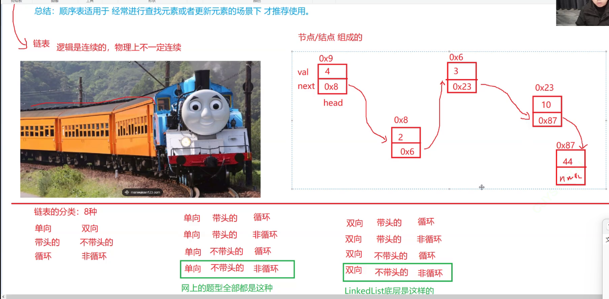
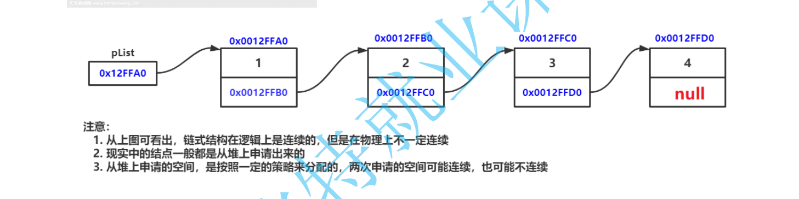

# **LinkedList与链表**

**【本节目标】**

1. **ArrayList的缺陷**

2. **链表**

3. **链表相关oj**

4. **LinkedList的模拟实现**

5. **LinkedList的使用**

6. **ArrayList和LinkedList的区别**

------

#### 1 **ArrayList的缺陷**

由于其底层是一段连续空间，当**在ArrayList任意位置插入或者删除元素时，就需要将后序元素整体往前或者往后**搬移，时间复杂度为O(n)**，效率比较低，因此**ArrayList不适合做任意位置插入和删除比较多的场景**。因此：java集合中又引入了LinkedList，即链表结构。

------

#### **2.** 链表

###### **2.1** 链表的概念及结构

链表是一种**物理存储结构上非连续**存储结构，数据元素的**逻辑顺序**是通过链表中的**引用链接**次序实现的 。





虽然有这么多的链表的结构，但是我们重点掌握两种:

- **无头单向非循环链表**：**结构简单**，一般不会单独用来存数据。实际中更多是作为**其他数据结构的子结构**，如哈希桶、图的邻接表等等。另外这种结构在**笔试面试**中出现很多
- **无头双向链表**：在Java的集合框架库中LinkedList底层实现就是无头双向循环链表。

###### **2.2** **链表的实现**

```
public class MySingleList {
    class ListNode{
        public int val;
        public ListNode next;//null

        public ListNode(int val){
            this.val=val;
        }
    }

    public ListNode head;

    public void createList(){
        ListNode node1 = new ListNode(12);
        ListNode node2 = new ListNode(23);
        ListNode node3 = new ListNode(34);
        ListNode node4 = new ListNode(45);
        ListNode node5 = new ListNode(56);

        node1.next = node2;
        node2.next = node3;
        node3.next = node4;
        node4.next = node5;

        this.head = node1;
    }

    public void show(){
        while(head != null){
            System.out.print(head.val+" ");
            head = head.next;
        }
        System.out.println();
    }
}
```

#### 3 **LinkedList的模拟实现**

#### 4 **LinkedList的使用**

##### **4.1 什么是LinkedList**

LinkedList的底层是双向链表结构(链表后面介绍)，由于链表没有将元素存储在连续的空间中，元素存储在单独的节点中，然后通过引用将节点连接起来了，因此在在任意位置插入或者删除元素时，不需要搬移元素，效率比较高。

1. LinkedList实现了List接口

2. LinkedList的底层使用了双向链表

3. LinkedList没有实现RandomAccess接口，因此LinkedList不支持随机访问

4. LinkedList的任意位置插入和删除元素时效率比较高，时间复杂度为O(1)

5. LinkedList比较适合任意位置插入的场景

##### **4.2 LinkedList的使用**

1. **LinkedList的构造**

| 方法                                         | 解释                           |
| -------------------------------------------- | ------------------------------ |
| LinkedList()                                 | 无参构造                       |
| public LinkedList(Collection<? extends E> c) | 使用其他集合容器中元素构造List |

```
public static void main(String[] args) {
  // 构造一个空的LinkedList
  List<Integer> list1 = new LinkedList<>();
  
  List<String> list2 = new java.util.ArrayList<>();
  list2.add("JavaSE");
  list2.add("JavaWeb");
  list2.add("JavaEE");
  // 使用ArrayList构造LinkedList
  List<String> list3 = new LinkedList<>(list2);
}
```

2. **LinkedList的其他常用方法介绍**

| 方法                                        | 解释                                |
| ------------------------------------------- | ----------------------------------- |
| boolean add(E e)                            | 尾插 e                              |
| void add(int index, E element)              | 将 e 插入到 index 位置              |
| boolean addAll(Collection<? extends E> c)   | 尾插 c 中的元素                     |
| E remove(int index)                         | 删除 index 位置元素                 |
| boolean remove(Object o)                    | 删除遇到的第一个 o                  |
| E get(int index)                            | 获取下标 index 位置元素             |
| E set(int index, E element)                 | 将下标 index 位置元素设置为 element |
| void clear()                                | 清空                                |
| boolean contains(Object o)                  | 判断 o 是否在线性表中               |
| int indexOf(Object o)                       | 返回第一个 o 所在下标               |
| int lastIndexOf(Object o)                   | 返回最后一个 o 的下标               |
| List<E> subList(int fromIndex, int toIndex) | 截取部分 list                       |

```
public static void main(String[] args) {
  LinkedList<Integer> list = new LinkedList<>();
  list.add(1); // add(elem): 表示尾插
  list.add(2);
  list.add(3);
  list.add(4);
  list.add(5);
  list.add(6);
  list.add(7);
  System.out.println(list.size());
  System.out.println(list);

// 在起始位置插入0
  list.add(0, 0); // add(index, elem): 在index位置插入元素elem
  System.out.println(list);
  
  list.remove(); // remove(): 删除第一个元素，内部调用的是removeFirst()
  list.removeFirst(); // removeFirst(): 删除第一个元素
  list.removeLast(); // removeLast(): 删除最后元素
  list.remove(1); // remove(index): 删除index位置的元素
  System.out.println(list);
  
// contains(elem): 检测elem元素是否存在，如果存在返回true，否则返回false
  if(!list.contains(1)){
    list.add(0, 1);
  }
  
  list.add(1);
  System.out.println(list);
  System.out.println(list.indexOf(1)); // indexOf(elem): 从前往后找到第一个elem的位置
  System.out.println(list.lastIndexOf(1)); // lastIndexOf(elem): 从后往前找第一个1的位置
  int elem = list.get(0); // get(index): 获取指定位置元素
  list.set(0, 100); // set(index, elem): 将index位置的元素设置为elem
  System.out.println(list);
  
  // subList(from, to): 用list中[from, to)之间的元素构造一个新的LinkedList返回
  List<Integer> copy = list.subList(0, 3); 
  System.out.println(list);
  System.out.println(copy);
  list.clear(); // 将list中元素清空
  System.out.println(list.size());
}
```

3. **LinkedList的遍历**

```
public static void main(String[] args) {
  LinkedList<Integer> list = new LinkedList<>();
  list.add(1); // add(elem): 表示尾插
  list.add(2);
  list.add(3);
  list.add(4);
  list.add(5);
  list.add(6);
  list.add(7);
  System.out.println(list.size());

  // foreach遍历
  for (int e:list) {
    System.out.print(e + " ");
  }
  System.out.println();
  
  // 使用迭代器遍历---正向遍历
  ListIterator<Integer> it = list.listIterator();
  while(it.hasNext()){
    System.out.print(it.next()+ " ");
  }
  System.out.println();
  
  // 使用反向迭代器---反向遍历
  ListIterator<Integer> rit = list.listIterator(list.size());
  while (rit.hasPrevious()){
    System.out.print(rit.previous() +" ");
  }
  System.out.println();
}
```

#### **5. ArrayList和LinkedList的区别**


| 不同点     | **ArrayList**            | **LinkedList**                       |
| ---------- | ------------------------ | ------------------------------------ |
| 存储空间上 | 物理上一定连续           | 逻辑上连续，但物理上不一定连续       |
| 随机访问   | 支持O(1)                 | 不支持：O(N)                         |
| 头插       | 需要搬移元素，效率低O(N) | 只需修改引用的指向，时间复杂度为O(1) |
| 插入       | 空间不够时需要扩容       | 没有容量的概念                       |
| 应用场景   | 元素高效查询+频繁访问    | 任意位置插入和删除频繁               |

