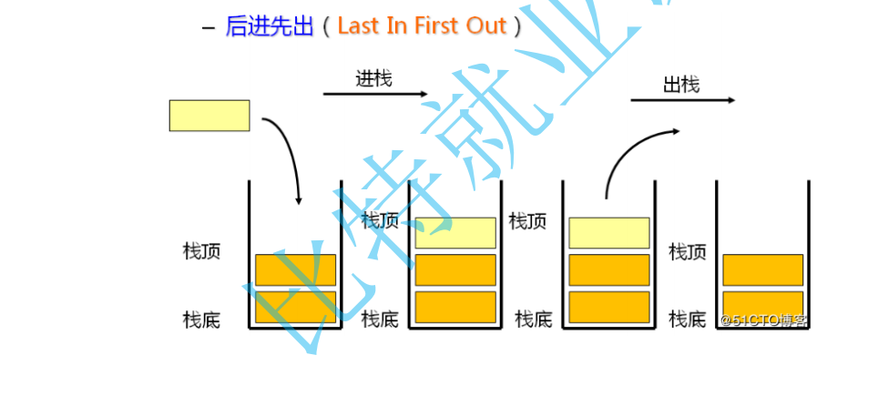
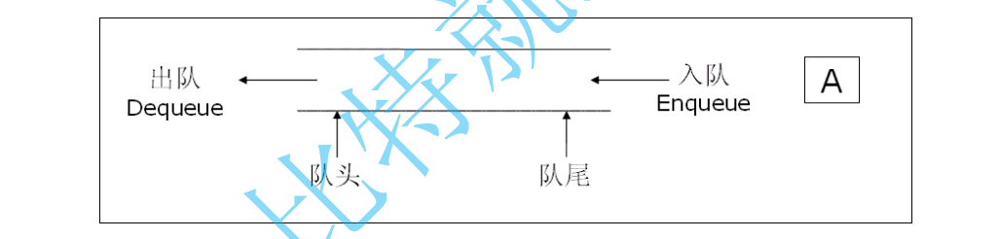
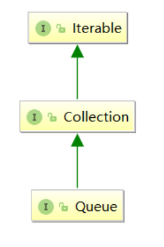
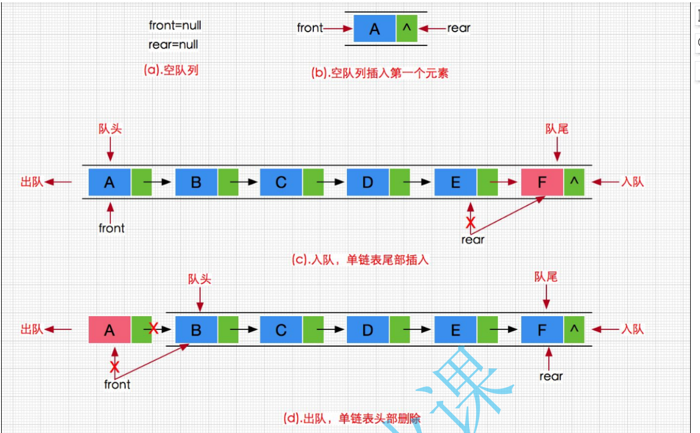
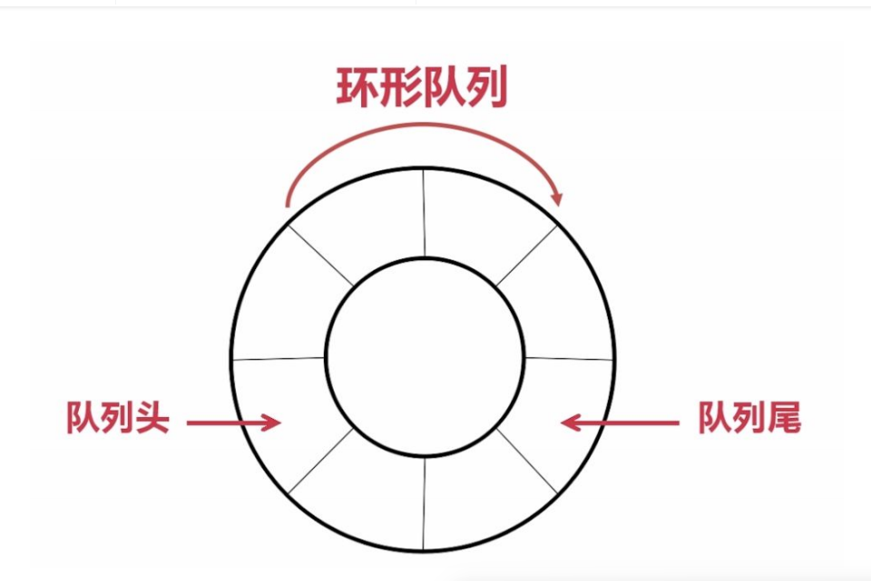
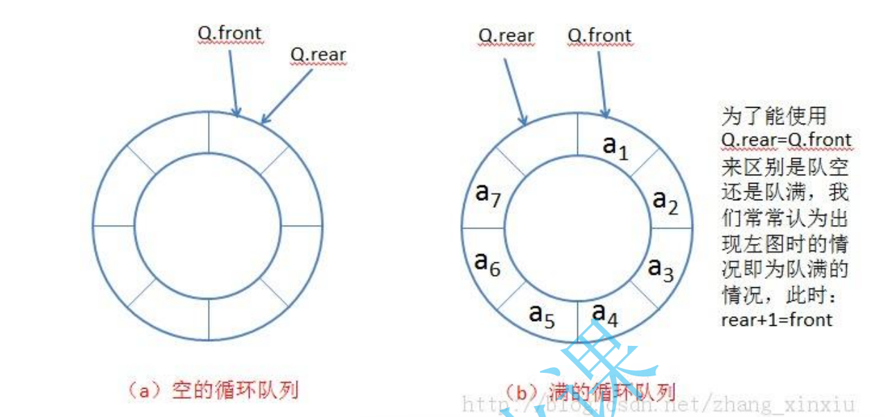
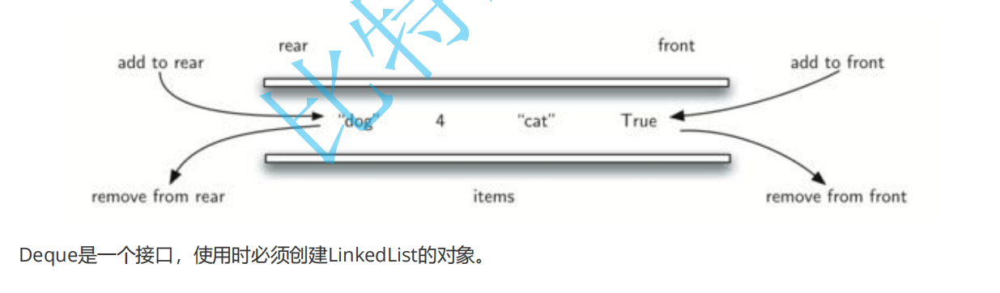

# **栈和队列**

#### **1. 栈(Stack)**

###### **1.1 概念**

**栈**：一种特殊的线性表，其**只允许在固定的一端进行插入和删除元素操作**。进行数据插入和删除操作的一端称为栈顶，另一端称为栈底。栈中的数据元素遵守后进先出LIFO（Last In First Out）的原则。

压栈：栈的插入操作叫做进栈/压栈/入栈，**入数据在栈顶**。

出栈：栈的删除操作叫做出栈。**出数据在栈顶**。



###### **1.2 栈的使用**

|    **方法**     |       **功能**       |
| :-------------: | :------------------: |
|     Stack()     |    构造一个空的栈    |
|   E push(E e)   |   将e入栈，并返回e   |
|     E pop()     | 将栈顶元素出栈并返回 |
|    E peek()     |     获取栈顶元素     |
|   int size()    | 获取栈中有效元素个数 |
| boolean empty() |    检测栈是否为空    |

```
public static void main(String[] args) {
  Stack<Integer> s = new Stack();
  s.push(1);
  s.push(2);
  s.push(3);
  s.push(4);
  System.out.println(s.size()); // 获取栈中有效元素个数---> 4
  System.out.println(s.peek()); // 获取栈顶元素---> 4
  s.pop(); // 4出栈，栈中剩余1 2 3，栈顶元素为3
  System.out.println(s.pop()); // 3出栈，栈中剩余1 2 栈顶元素为3
  if(s.empty()){
    System.out.println("栈空");
  }else{
    System.out.println(s.size());
  }
}
```

###### **1.3 栈的模拟实现**

```
public class MyStack {
    private int[] elem;
    private int usedSize;

    public MyStack() {
        this.elem = new int[5];
    }

    //压栈
    public void push(int val) {
        if(isFull()) {
            elem = Arrays.copyOf(elem,2*elem.length);
        }
        elem[usedSize] = val;
        usedSize++;
    }

    public boolean isFull() {
        return usedSize == elem.length;
    }


    //出栈
    public int pop() {
        //1、判断栈不为空
        if(empty()) {
            //抛出异常！！
            throw new StackEmptyException("栈为空！");
        }
        //2、开始删除
        return elem[--usedSize];
    }

    //获取栈顶元素
    public int peek() {
        //1、判断栈不为空
        if(empty()) {
            //抛出异常！！
            throw new StackEmptyException("栈为空！");
        }
        //2、开始删除
        return elem[usedSize-1];
    }

    public boolean empty() {
        return usedSize == 0;
    }
}
```

###### **1.4** **栈的应用场景**


2 **将递归转化为循环**

比如：逆序打印链表

```
// 递归方式
void printList(Node head){
  if(null != head){
    printList(head.next);
    System.out.print(head.val + " ");
  }
}

// 循环方式
void printList(Node head){
  if(null == head){
    return;
  }
  
  Stack<Node> s = new Stack<>();
  // 将链表中的结点保存在栈中
  Node cur = head;
  while(null != cur){
    s.push(cur);
    cur = cur.next;
  }
  
  // 将栈中的元素出栈
  while(!s.empty()){
    System.out.print(s.pop().val + " ");
  }
}
```

3. **逆波兰表达式求值**

4. **出栈入栈次序匹配**

   [^栈的压入、弹出序列_牛客题霸_牛客网]: (https://www.nowcoder.com/practice/d77d11405cc7470d82554cb392585106?tpId=13&&tqId=11174&rp=1&ru=/activity/oj&qru=/ta/coding-interviews/question-ranking)

   

5.  **最小栈**

   [^155. 最小栈 - 力扣]: (https://leetcode.cn/problems/min-stack/)

   

####  

------

#### 2. **队列(Queue)**

###### **2.1 概念**

**队列**：只允许在一端进行插入数据操作，在另一端进行删除数据操作的特殊线性表，队列具有先进先出FIFO(First

In First Out) 入队列：进行插入操作的一端称为**队尾（Tail/Rear）** 出队列：进行删除操作的一端称为**队头（Head/Front）**



###### 2.2 队列的使用

在Java中，**Queue是个接口，底层是通过链表实现**的。



|      **方法**      |        **功能**        |
| :----------------: | :--------------------: |
| boolean offer(E e) |         入队列         |
|      E poll()      |         出队列         |
|       peek()       |      获取队头元素      |
|     int size()     | 获取队列中有效元素个数 |
| boolean isEmpty()  |    检测队列是否为空    |

注意：Queue是个接口，在实例化时必须实例化LinkedList的对象，因为LinkedList实现了Queue接口。

###### **2.3** **队列模拟实现**

队列中既然可以存储元素，那底层肯定要有能够保存元素的空间，通过前面线性表的学习了解到常见的空间类型有两种：**顺序结构 和 链式结构**。思考下：**队列的实现使用顺序结构还是链式结构好？**



###### **2.4** **循环队列**

实际中我们有时还会使用一种队列叫循环队列。如操作系统课程讲解生产者消费者模型时可以就会使用循环队列。环形队列通常使用数组实现。



队尾元素的下标rear的移动： rear = ( rear + 1) % elem.length;
头元素的下标：front = (front + 1) % elem.length

**如何区分空与满**

1. 通过添加 size 属性记录

2. 保留一个位置

3. 使用标记



[设计循环队列]: https://leetcode.cn/problems/design-circular-queue/

#### **3.** **双端队列 (Deque)**

双端队列（Deque）是指允许两端都可以进行入队和出队操作的队列，Deque 是 “double ended queue” 的简称。那就说明元素可以从队头出队和入队，也可以从队尾出队和入队。



在实际工程中，使用Deque接口是比较多的，栈和队列均可以使用该接口。

```
Deque<Integer> stack = new ArrayDeque<>();//双端队列的线性实现
Deque<Integer> queue = new LinkedList<>();//双端队列的链式实现
```

#### **4.** **面试题**

1. [用队列实现栈]: https://leetcode.cn/problems/implement-stack-using-queues/

   

2. [用栈实现队列]: https://leetcode.cn/problems/implement-queue-using-stacks/

   