# 二叉树

### 1.树型结构（了解）

#### 1.1 概念

树是一种**非线性**的数据结构，它是由n（n>=0）个有限结点组成一个具有层次关系的集合。**把它叫做树是因为它看**

**起来像一棵倒挂的树，也就是说它是根朝上，而叶朝下的**。它具有以下的特点：

- 有一个特殊的结点，称为根结点，根结点没有前驱结点

- 除根结点外，其余结点被分成M(M > 0)个互不相交的集合T1、T2、......、Tm，其中每一个集合Ti (1 <= i <=m) 又是一棵与树类似的子树。每棵子树的根结点有且只有一个前驱，可以有0个或多个后继

- 树是递归定义的。

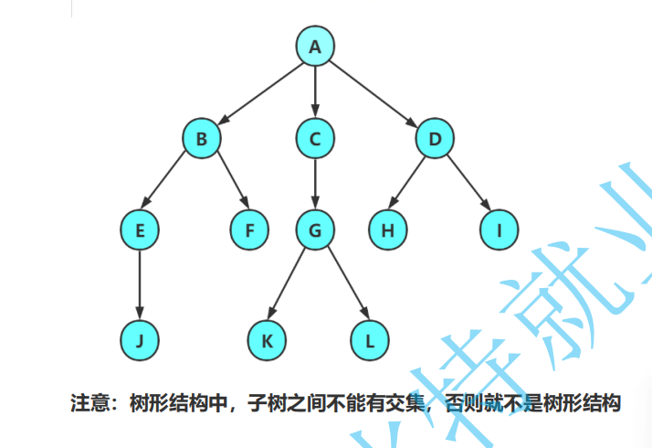

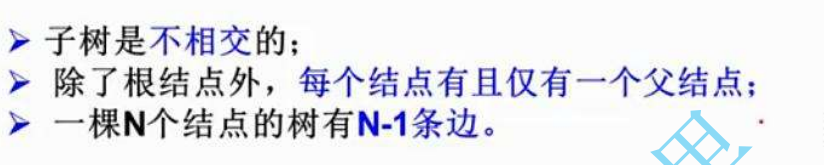

#### 1.2 概念（重要）

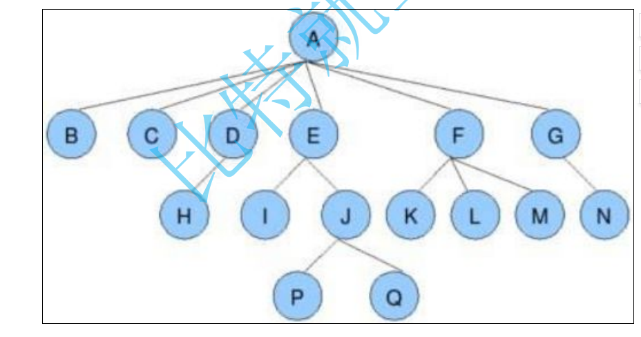

**结点的度**：一个结点含有子树的个数称为该结点的度； 如上图：A的度为6

**树的度**：一棵树中，所有结点度的最大值称为树的度； 如上图：树的度为6

**叶子结点或终端结点**：度为0的结点称为叶结点； 如上图：B、C、H、I...等节点为叶结点

**双亲结点或父结点**：若一个结点含有子结点，则这个结点称为其子结点的父结点； 如上图：A是B的父结点

**孩子结点或子结点**：一个结点含有的子树的根结点称为该结点的子结点； 如上图：B是A的孩子结点

**根结点**：一棵树中，没有双亲结点的结点；如上图：A

**结点的层次**：从根开始定义起，根为第1层，根的子结点为第2层，以此类推

**树的高度或深度**：树中结点的最大层次； 如上图：树的高度为4

树的以下概念只需了解，在看书时只要知道是什么意思即可：

**非终端结点或分支结点**：度不为0的结点； 如上图：D、E、F、G...等节点为分支结点

**兄弟结点**：具有相同父结点的结点互称为兄弟结点； 如上图：B、C是兄弟结点

**堂兄弟结点**：双亲在同一层的结点互为堂兄弟；如上图：H、I互为兄弟结点

**结点的祖先**：从根到该结点所经分支上的所有结点；如上图：A是所有结点的祖先

**子孙**：以某结点为根的子树中任一结点都称为该结点的子孙。如上图：所有结点都是A的子孙

**森林**：由m（m>=0）棵互不相交的树组成的集合称为森林

#### 1.3 树的表示形式（了解）

树结构相对线性表就比较复杂了，要存储表示起来就比较麻烦了，实际中树有很多种表示方式，如：**双亲表示法**，

**孩子表示法**、**孩子双亲表示法**、**孩子兄弟表示法**等等。我们这里就简单的了解其中最常用的**孩子兄弟表示法**。

```
class Node {
  int value; // 树中存储的数据
  Node firstChild; // 第一个孩子引用
  Node nextBrother; // 下一个兄弟引用
}
```

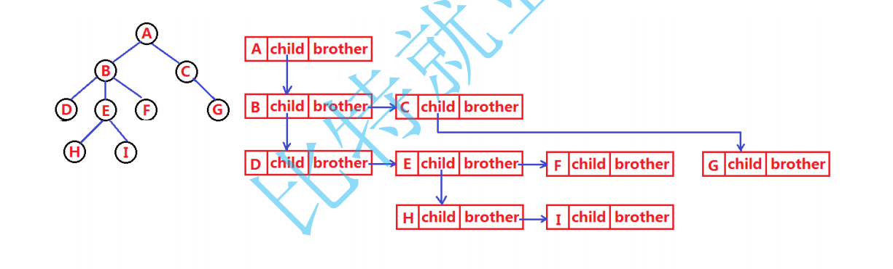

#### 1.4 树的应用

文件系统管理（目录和文件）

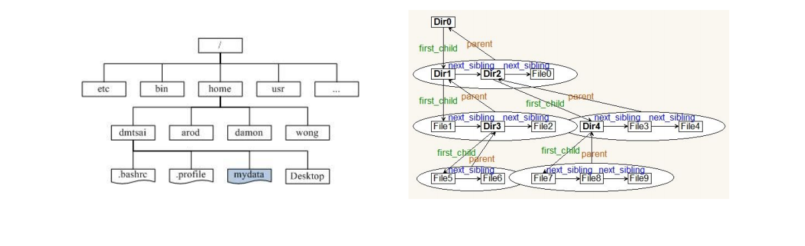

------

### 2. 二叉树（重点）

#### 2.1 概念

一棵二叉树是结点的一个有限集合，该集合：

1. 或者为空

2. 或者是由**一个根节**点加上两棵别称为**左子树**和**右子树**的二叉树组成。

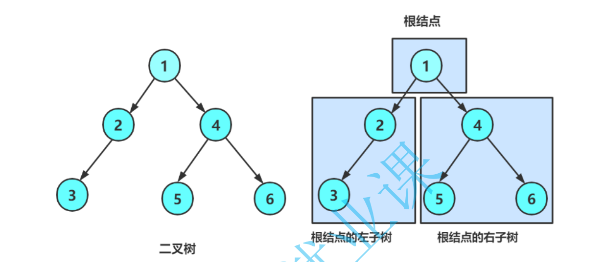

从上图可以看出：

1. 二叉树不存在度大于2的结点

2. 二叉树的子树有左右之分，次序不能颠倒，因此二叉树是有序树

注意：对于任意的二叉树都是由以下几种情况复合而成的：


#### 2.2 两种特殊的二叉树

1. **满二叉树**: 一棵二叉树，如果**每层的结点数都达到最大值，则这棵二叉树就是满二叉树**。也就是说，**如果一棵**

**二叉树的层数为**K**，且结点总数是****，则它就是满二叉树**。

2. **完全二叉树:** 完全二叉树是效率很高的数据结构，完全二叉树是由满二叉树而引出来的。对于深度为K的，有n

个结点的二叉树，当且仅当其每一个结点都与深度为K的满二叉树中编号从0至n-1的结点一一对应时称之为完

全二叉树。 要注意的是满二叉树是一种特殊的完全二叉树。

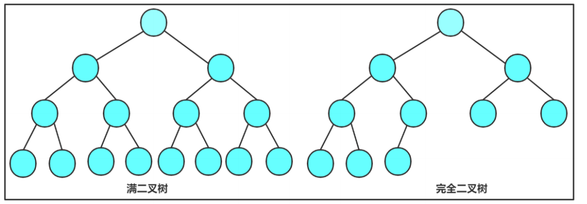

#### 2.3 二叉树的性质

1. 若规定**根结点的层数为1**，则一棵**非空二叉树的第i层上最多有** **(i>**个结点**

2. 若规定只有**根结点的二叉树的深度为1**，则**深度为K的二叉树的最大结点数是**   

   (k>=0)

3. 对任何一棵二叉树, 如果其**叶结点个数为** **n0,** **度为2的非叶结点个数为n2,则有n0＝n2＋1**

   （叶子结点个数  比  度为2的结点个数多一个）

   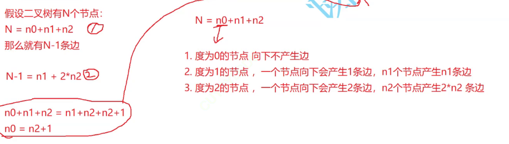

4. 具有**n个结点的完全二叉树的深度k为** 

   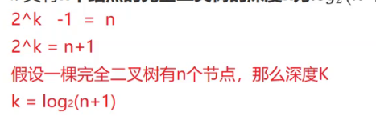

5. 对于具有**n个结点的完全二叉树**，如果按照**从上至下从左至右的顺序对所有节点从0开始编号**，则对于**序号为i**

**的结点有**：

- 若i>0，**双亲序号：(i-1)/2；i=0，i为根结点编号**，无双亲结点
- **若2i+1<n，左孩子序号：2i+1，否则无左孩子**
- **若2i+2<n，右孩子序号：2i+2，否则无右孩子**


#### 2.4 二叉树的存储

**二叉树的存储结构**分为：**顺序存储**和**类似于链表的链式存储**。

顺序存储在下节介绍。

**二叉树的链式存储是通过一个一个的节点引用起来的，常见的表示方式有二叉和三叉表示方式**，具体如下：

```
// 孩子表示法
class Node {
  int val; // 数据域
  Node left; // 左孩子的引用，常常代表左孩子为根的整棵左子树
  Node right; // 右孩子的引用，常常代表右孩子为根的整棵右子树
}

// 孩子双亲表示法
class Node {
  int val; // 数据域
  Node left; // 左孩子的引用，常常代表左孩子为根的整棵左子树
  Node right; // 右孩子的引用，常常代表右孩子为根的整棵右子树
  Node parent; // 当前节点的根节点
}
```

#### 2.5 二叉树的基本操作

##### 2.5.1 前置说明

在学习二叉树的基本操作前，需先要创建一棵二叉树，然后才能学习其相关的基本操作。由于现在大家对二叉树结

构掌握还不够深入，为了降低大家学习成本，此处手动快速创建一棵简单的二叉树，快速进入二叉树操作学习，等

二叉树结构了解的差不多时，我们反过头再来研究二叉树真正的创建方式。

```
public class BinaryTree{
  public static class BTNode{
    BTNode left;
    BTNode right;
    int value;
    BTNode(int value){
      this.value = value;
    }
  }
  
private BTNode root;

  public void createBinaryTree(){
    BTNode node1 = new BTNode(1);
    BTNode node2 = new BTNode(2);
    BTNode node3 = new BTNode(3);
    BTNode node4 = new BTNode(4);
    BTNode node5 = new BTNode(5);
    BTNode node6 = new BTNode(6);
    
    root = node1;
    node1.left = node2;
    node2.left = node3;
    node1.right = node4;
    node4.left = node5;
    node5.right = node6;
  }
}
```

注意：上述代码并不是创建二叉树的方式，真正创建二叉树方式后序详解重点讲解

##### 2.5.2 二叉树的遍历

###### 1.前中后序遍历

学习二叉树结构，最简单的方式就是遍历。所谓**遍历(Traversal)是指沿着某条搜索路线，依次对树中每个结**

**点均做一次且仅做一次访问**。**访问结点所做的操作依赖于具体的应用问题(比如：打印节点内容、节点内容加**

**1)**。 遍历是二叉树上最重要的操作之一，是二叉树上进行其它运算之基础。


NLR：前序遍历(Preorder Traversal 亦称先序遍历)——访问根结点--->根的左子树--->根的右子树。

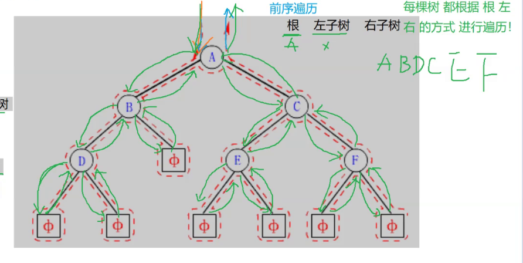

LNR：中序遍历(Inorder Traversal)——根的左子树--->根节点--->根的右子树。

LRN：后序遍历(Postorder Traversal)——根的左子树--->根的右子树--->根节点。

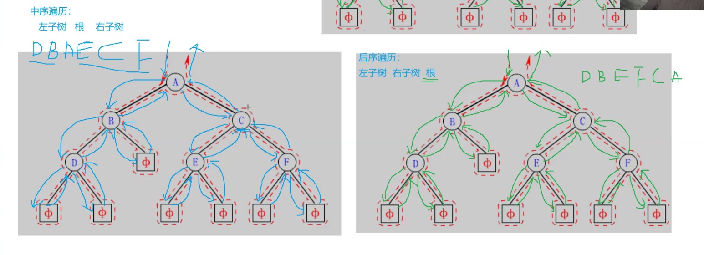

###### 2.**层序遍历**

**层序遍历**：除了先序遍历、中序遍历、后序遍历外，还可以对二叉树进行层序遍历。设二叉树的根节点所在

层数为1，层序遍历就是从所在二叉树的根节点出发，首先访问第一层的树根节点，然后从左到右访问第2层

上的节点，接着是第三层的节点，以此类推，自上而下，自左至右逐层访问树的结点的过程就是层序遍历。

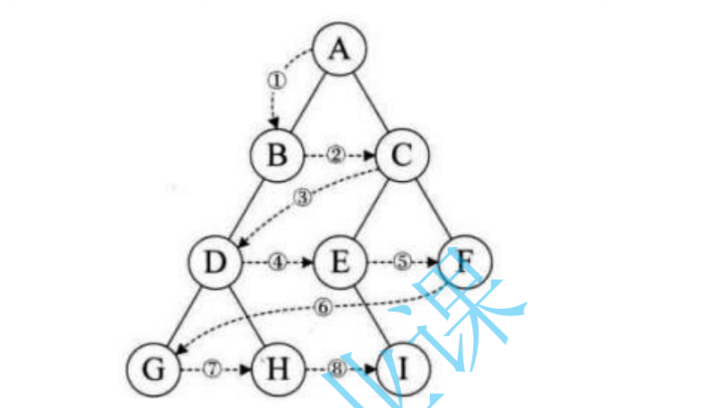