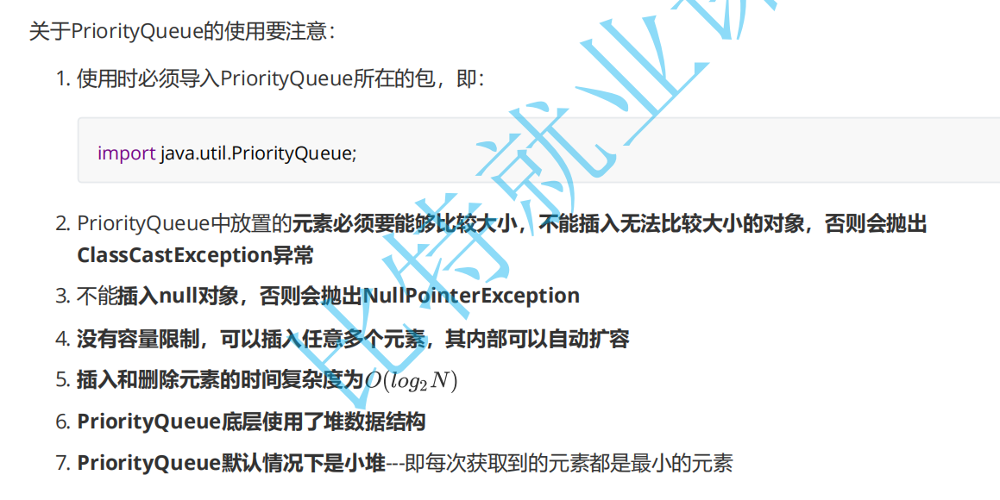

# **优先级队列(堆)**

### 1.优先级队列

#### 1.1 概念

前面介绍过队列，**队列是一种先进先出**(FIFO)的数据结构**，但有些情况下，**操作的数据可能带有优先级，一般出队列时，可能需要优先级高的元素先出队列，该中场景下，使用队列显然不合适，比如：在手机上玩游戏的时候，如

果有来电，那么系统应该优先处理打进来的电话；初中那会班主任排座位时可能会让成绩好的同学先挑座位。

在这种情况下，**数据结构应该提供两个最基本的操作，一个是返回最高优先级对象，一个是添加新的对象**。这种数

据结构就是**优先级队列**(Priority Queue)。

------

### 2. 优先级队列的模拟实现

JDK1.8中的**PriorityQueue底层使用了堆这种数据结构**，而堆实际就是在完全二叉树的基础上进行了一些调整。

#### 2.1 堆的概念

如果有一个**关键码的集合K = {k0，k1，k2，…，kn-1}**，把它的所有元素**按完全二叉树的顺序存储方式存储 在一**

**个一维数组中**，并满足：**Ki <= K2i+1** **且** **Ki<= K2i+2** (Ki >= K2i+1 且 Ki >= K2i+2) i = 0，1，2…，则**称为 小堆**(或大堆)。将根节点最大的堆叫做最大堆或大根堆，根节点最小的堆叫做最小堆或小根堆。

**堆的性质：**

堆中某个节点的值总是不大于或不小于其父节点的值；

堆总是一棵完全二叉树

#### 2.2 堆的存储方式

#### 2.3 堆的创建

插入数据后，向上调整

删除元素，只能删除堆顶

------

### 3.常用接口介绍

#### **3.1 PriorityQueue的特性**

Java集合框架中提供了**PriorityQueue**和**PriorityBlockingQueue**两种类型的优先级队列，**PriorityQueue是线**

**程不安全的，**PriorityBlockingQueue是线程安全的，本文主要介绍PriorityQueue。

#### **3.2 PriorityQueue常用接口介绍**

**1.优先级队列的构造**

| 构造器                                    | 功能介绍                                                     |
| ----------------------------------------- | ------------------------------------------------------------ |
| PriorityQuenu()                           | 创建一个空的优先级队列，默认容量是11                         |
| PriorityQuenu(int initialCapacity)        | 创建一个初始容量为initialCapacity的优先级队列，注意：initialCapacity不能小于1，否则会抛IllegalArgumentException异常 |
| PriorityQuenu(Collection <? extends E> c) | 用一个集合来创建优先级队列                                   |

